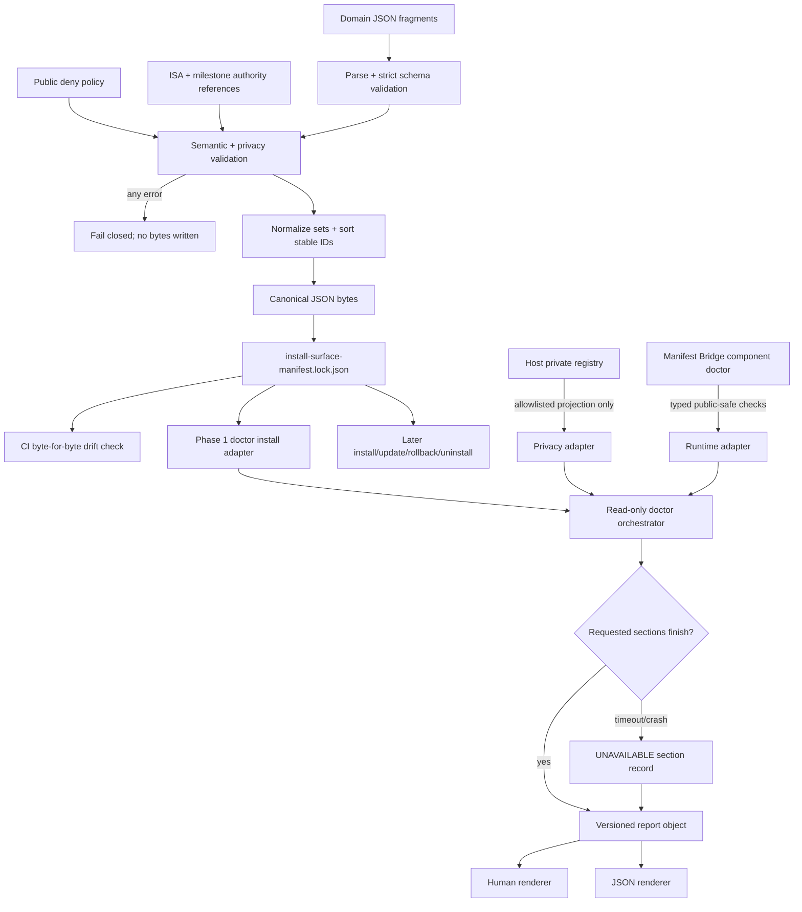

# Phase 1: Provenance Contract and Read-Only Control Plane - Research

**Researched:** 2026-08-20
**Domain:** Deterministic install provenance, privacy-safe host observation, and read-only CLI control planes
**Confidence:** HIGH

<user_constraints>
## User Constraints (from CONTEXT.md)

> Source for this verbatim section: `[VERIFIED: .planning/phases/01-provenance-contract-and-read-only-control-plane/01-CONTEXT.md]`

### Locked Decisions

#### Manifest Organization

- **D-01:** Contributors author domain-specific JSON fragments. A deterministic resolver validates and combines them into one canonical inventory.
- **D-02:** The generated inventory is committed as `install-surface-manifest.lock.json`. CI must reject regeneration drift, and release artifacts package those exact reviewed bytes.
- **D-03:** Every surface has an immutable, human-readable semantic ID that survives source moves. Content changes are tracked independently through digests; intentional identity changes require an explicit migration.
- **D-04:** Schema validation is strict. Unknown fields and unsupported versions fail closed. Additive changes increment the minor version; breaking changes require a new major version and an explicit migration path.

#### Private-Boundary Records

- **D-05:** Known NEVER-SHIP surfaces appear as public-safe symbolic records. A separate generic deny policy blocks emerging secret, database, log, history, memory, backup, and private-root patterns.
- **D-06:** Public doctor output may report only a private overlay's logical identity, presence state, and exclusion policy. It must never print its resolved path, traverse its contents, or calculate its digest.
- **D-07:** An unexpected deny-policy match stops validation, mutation, and packaging before side effects. The error names the symbolic rule and shows a repository-relative offending path only when safe; the candidate is never silently altered.
- **D-08:** Optional private overlays register in a versioned, host-owned private registry under the operator Temperance state root with restrictive permissions. The repository is never the registry authority.
- **D-09:** An absent private registry is healthy and means no overlays. Malformed records, unsafe permissions, or bindings escaping the operator-owned state root fail privacy validation.
- **D-10:** Public tooling may read only registry schema version, logical overlay ID, overlay class, enabled state, presence status, and policy-rule ID. Paths, opaque bindings, labels, provider names, and notes stay private.
- **D-11:** Overlay health uses an optional-state ladder: disabled or unregistered is `SKIPPED`; enabled and present is `PRIVATE`; enabled but missing is `WARN`; malformed, insecure, or policy-violating registry state is `FAIL`.
- **D-12:** Unregistering removes only the host-owned registry record. It never traverses, moves, modifies, or deletes overlay data. A private local receipt retains only logical ID and timestamp.

#### Public Doctor Command

- **D-13:** `temperance doctor` is the single public inspection entry point. It composes named install-provenance, private-boundary, and runtime-health sections; component doctors remain available for focused diagnostics.
- **D-14:** Every doctor command is permanently read-only. Existing mutating doctor flags must move to separately governed repair or lifecycle commands with their own preview, backup, and confirmation contracts.
- **D-15:** Running without filters checks every section. Repeatable `--section install`, `--section privacy`, and `--section runtime` filters narrow execution and mark the report explicitly partial.
- **D-16:** Sections execute with bounded timeouts. A crashed, timed-out, or unavailable section becomes `UNAVAILABLE`; remaining sections continue, and overall health is calculated after evidence collection finishes.

#### Doctor Presentation and Exits

- **D-17:** Human output is drift-first and remediation-first: overall health, section summaries, every non-healthy item, and actionable remediation appear first. `--verbose` expands every public-safe inventory record and observation.
- **D-18:** Human and JSON reports share `PASS`, `DRIFT`, `WARN`, `FAIL`, `SKIPPED`, `UNSUPPORTED`, `PRIVATE`, and `UNAVAILABLE`. Every check also carries a stable reason code and severity.
- **D-19:** Process exits use three levels: `0` for a trustworthy report without actionable findings, `1` for a trustworthy report with actionable findings, and `2` when doctor cannot produce a trustworthy report because of invalid arguments, schema, or orchestration failure.
- **D-20:** `temperance doctor --json` emits one versioned document envelope containing generation time, complete/partial scope, requested sections, overall condition, exit code, manifest digest, and deterministically ordered section/check records. Breaking compatibility changes require a new schema major version.

### the agent's Discretion

Downstream research and planning may choose exact fragment filenames and groupings, internal module boundaries, timeout durations, reason-code names, and implementation sequencing. Those choices must preserve all decisions above, introduce no new production dependency without justification, and keep the authored fragments plus committed lockfile as the only public provenance authority.

### Deferred Ideas (OUT OF SCOPE)

- Actual repair commands and their transactional safety contract belong to Phase 3.
- Private overlay registration/unregistration mutation commands belong to a later lifecycle plan; Phase 1 defines only their ownership and observation contracts.
- Public source convergence and release-tree deny enforcement across the complete payload belong to Phase 2, built on this phase's contract.
</user_constraints>

<phase_requirements>
## Phase Requirements

| ID | Description | Research Support |
|----|-------------|------------------|
| PROV-01 | A maintainer can validate the versioned installation-manifest schema before any lifecycle action runs. | Strict Draft 2020-12 schemas, Ajv strict compilation, and a validate-before-observe pipeline. `[VERIFIED: .planning/REQUIREMENTS.md; CITED: https://ajv.js.org/strict-mode.html]` |
| PROV-02 | Every included installed surface resolves to exactly one stable manifest record with an owner and classification. | Immutable semantic IDs, required owner/class fields, canonical record sorting, and exact uniqueness checks. `[VERIFIED: 01-CONTEXT.md D-01..D-04]` |
| PROV-03 | Manifest validation rejects duplicate or overlapping destination ownership before mutation. | Root-token-scoped ownership trie plus explicit managed-subresource collision rules. `[VERIFIED: .planning/REQUIREMENTS.md; 01-CONTEXT.md D-07]` |
| PROV-04 | Manifest sources are repository-relative and destinations use allowlisted root tokens rather than workstation-specific absolute paths. | Segment-based source validation and structured `{root_token, relative_path}` destinations. `[VERIFIED: .planning/REQUIREMENTS.md; .planning/PROJECT.md]` |
| PROV-05 | Semantic validation rejects path escapes, dependency cycles, contradictory classifications, and unsafe adapter combinations. | Separate semantic pass after structural schema validation, deterministic cycle detection, discriminated class contracts, and adapter-ID allowlists. `[VERIFIED: .planning/ROADMAP.md Phase 1]` |
| PROV-07 | Manifest entries cannot expand the public product beyond the explicitly ratified ISA and milestone scope. | Required authority references plus an early ISA ratification gate for the stable semantic-ID set; no manifest-local self-ratification. `[VERIFIED: .planning/PROJECT.md authority order; ISA.md ISC-769..ISC-780]` |
| DOCT-01 | Users can run a read-only doctor command that explains installation and health in human-readable form. | Typed top-level composer and a render-only human formatter. `[VERIFIED: 01-CONTEXT.md D-13..D-17]` |
| DOCT-02 | Automation can request the same doctor observations as stable JSON without triggering repair. | One report object feeds both renderers; JSON has no persistence flag and doctor exposes no write capability. `[VERIFIED: 01-CONTEXT.md D-14, D-20]` |
| DOCT-03 | Each doctor entry reports source, destination, class, expected state, actual state, status, and remediation. | Uniform check record schema across install, privacy, and runtime sections, using symbolic values where paths are private. `[VERIFIED: .planning/REQUIREMENTS.md; 01-CONTEXT.md Specific Ideas]` |
| DOCT-04 | Drift produces an explicit `DRIFT` result or non-zero exit without modifying the machine. | Class-aware observers, actionability aggregation, exit `1`, and read-only invariant tests. `[VERIFIED: 01-CONTEXT.md D-18..D-19]` |
| DOCT-05 | Doctor distinguishes required failures from optional skips and unsupported platform capabilities. | Eligibility/requiredness fields plus explicit `FAIL`, `SKIPPED`, and `UNSUPPORTED` conditions. `[VERIFIED: .planning/REQUIREMENTS.md]` |
| SAFE-04 | Path resolution rejects absolute manifest sources, traversal, and destinations outside allowlisted roots. | Reject-before-resolve lexical checks, canonical containment checks, unknown-root rejection, and adversarial fixtures. `[VERIFIED: .planning/REQUIREMENTS.md; CITED: https://owasp.org/www-community/attacks/Path_Traversal]` |
| SAFE-07 | Verification applies classification-aware checksum rules to copied, transformed, generated, and private-overlay surfaces. | Discriminated verification policies: byte digest, in-memory adapter output, semantic probe, and symbolic/presence-only privacy checks. `[VERIFIED: .planning/REQUIREMENTS.md; 01-CONTEXT.md D-05..D-06]` |
</phase_requirements>

## Summary

Phase 1 should be planned as a policy compiler plus a read-only observation boundary, not as an installer and not as an extension of Manifest Bridge's event catalog. Put the authored fragments, strict schemas, deny policy, deterministic compiler, and exact committed lockfile in a standalone `package/install-surface/` package. The compiler must finish all structural, semantic, authority, deny-policy, and determinism checks in memory before its explicit lockfile-writing command is allowed to write. `[HIGH]` `[VERIFIED: 01-CONTEXT.md D-01..D-07; Existing Code Insights]`

The top-level doctor should consume the committed lockfile, a public-safe projection of the host-owned private registry, and typed runtime component adapters. It must build one report object and render human or JSON from that object. Current mutating Manifest Bridge doctor behaviors (`--record` and `--repair-duplicates`) must leave the doctor command surface, because the current implementation writes diagnostics, backups, temporary files, and repaired JSONL. `[HIGH]` `[VERIFIED: package/manifest-bridge/src/doctor.ts; package/manifest-bridge/src/cli.ts; 01-CONTEXT.md D-13..D-20]`

The milestone-wide leverage point is the lockfile's type and byte stability. Phase 3 lifecycle execution, Phase 4 service control, Phase 6 qualification, and Phase 7 release proof should import or load this exact model; none should reconstruct ownership from shell lists or rendered doctor text. Phase 1 therefore needs stronger deterministic and compatibility tests than a normal diagnostic feature. `[HIGH]` `[VERIFIED: .planning/ROADMAP.md; docs/plans/2026-08-19-mac-mini-to-public-temperance-glove-audit.md]`

**Primary recommendation:** Build `package/install-surface/` as the sole public provenance compiler and top-level read-only doctor implementation; keep Manifest Bridge as one typed runtime adapter and make later lifecycle phases consume the committed lockfile bytes. `[VERIFIED: 01-CONTEXT.md D-01, D-02, D-13]`

## Architectural Responsibility Map

| Capability | Primary Tier | Secondary Tier | Rationale |
|------------|-------------|----------------|-----------|
| Authored provenance fragments | Repository / Static authority | CI | Reviewed source declarations belong in git; host state must not author them. `[VERIFIED: D-01, D-08]` |
| Strict schema and semantic validation | Local CLI / Control plane | CI | Validation must precede lifecycle action and run identically in contributor and CI contexts. `[VERIFIED: PROV-01, D-04]` |
| Canonical lockfile compilation | Local CLI / Control plane | Repository / Static authority | The CLI computes exact bytes; git stores and reviews them. `[VERIFIED: D-02]` |
| Destination token resolution | Lifecycle API / Backend | Host storage | The manifest declares logical roots; later lifecycle code binds tokens to a particular host. `[VERIFIED: PROV-04; .planning/ROADMAP.md Phase 3]` |
| Private overlay registry | Host storage | Privacy doctor adapter | The operator state root owns private bindings; public tooling receives an allowlisted projection only. `[VERIFIED: D-06, D-08..D-10]` |
| Deny policy | Repository / Static policy | Compiler and release CI | Stable symbolic rules are public; candidate paths are checked before any write or packaging. `[VERIFIED: D-05, D-07]` |
| Install provenance observations | Local CLI / Control plane | Filesystem | The install section reads declared sources/destinations and applies class-aware verification. `[VERIFIED: DOCT-01..DOCT-04, SAFE-07]` |
| Runtime health observations | Component adapters | Local CLI / Control plane | Components own their probes; the top-level doctor composes typed results without parsing text. `[VERIFIED: D-13, Existing Code Insights]` |
| Human and JSON presentation | CLI / Client | — | Both are pure projections of the same normalized report. `[VERIFIED: D-17, D-18, D-20]` |

## Project Constraints (from AGENTS.md)

- Keep `ISA.md` as acceptance authority, `.planning/` as the GSD execution spine, and `scripts/verify-all.sh` as the canonical repository verification entrypoint. `[VERIFIED: AGENTS.md; .planning/PROJECT.md]`
- Do not create a second planner or preference store; the provenance manifest owns mechanics, not product preference or acceptance. `[VERIFIED: AGENTS.md; .planning/PROJECT.md]`
- Do not fork GSD core; wrappers continue to consume the configured upstream workflows. `[VERIFIED: AGENTS.md]`
- Keep handoff/manual transition behavior unless the operator explicitly enables automation. `[VERIFIED: AGENTS.md; .planning/config.json workflow.auto_advance=false]`
- Do not require Claude Code, Anthropic, Codex, or any specific provider/model for product correctness. `[VERIFIED: AGENTS.md]`
- Keep local PAI state under `${PAI_HOME:-$HOME/.claude}` and host runtime/model credentials outside the public repository. `[VERIFIED: AGENTS.md; .planning/PROJECT.md]`
- For `.agents` architecture questions use its own CodeGraph, but this repository itself currently has no initialized CodeGraph; direct reads and literal searches were therefore used for this research. `[VERIFIED: AGENTS.md; codegraph_status probe 2026-08-20]`
- No project-local `.codex/skills/` or `.agents/skills/` directory exists in this checkout, so no additional project skill rules constrain this phase. `[VERIFIED: filesystem discovery 2026-08-20]`

## Standard Stack

### Core

| Library / Runtime | Version | Purpose | Why Standard Here |
|-------------------|---------|---------|-------------------|
| Bun | 1.3.13 available; 1.3.14 registry latest | Execute TypeScript CLI and tests | The repository already uses Bun and `bun:test`; retain the available runtime floor instead of forcing an unrelated upgrade. `[VERIFIED: environment probe; package/manifest-bridge/package.json; npm registry]` |
| TypeScript ESM | Bun-provided | Typed manifest, discriminated unions, adapters, and report contracts | Existing Manifest Bridge code is TypeScript ESM with `node:*` built-ins. `[VERIFIED: package/manifest-bridge/src/*.ts]` |
| JSON Schema | Draft 2020-12 | Structural contracts for fragments, lockfile, private registry, and doctor report | Draft 2020-12 supplies `unevaluatedProperties` for strict composed schemas. `[CITED: https://json-schema.org/draft/2020-12]` |
| `ajv` | 8.20.0, published 2026-04-24 | Compile and validate Draft 2020-12 schemas in strict mode | Ajv officially supports Draft 2020-12 and strict schema compilation; this avoids maintaining a partial validator. `[VERIFIED: npm registry; slopcheck npm OK; CITED: https://ajv.js.org/json-schema.html]` |
| Node-compatible built-ins | Bun 1.3.13 implementation | SHA-256, filesystem observation, path containment, child-process probes | `node:crypto`, `node:fs`, `node:path`, and `node:child_process` are already the repository pattern and add no package. `[VERIFIED: package/manifest-bridge/src; package/router/*.ts]` |

### Supporting

| Library / Tool | Version | Purpose | When to Use |
|----------------|---------|---------|-------------|
| `bun:test` | Bun 1.3.13 | Unit, fixture, golden-byte, and CLI tests | Use for all new TypeScript behavior and keep shell only for installed-command integration. `[VERIFIED: package/manifest-bridge/test/bridge.test.ts]` |
| `jq` | 1.7.1 available | Existing shell compatibility tests | Do not make the new public doctor depend on it; the present shell doctor exits 127 when it is missing, which violates D-19. `[VERIFIED: scripts/temperance-doctor.sh; environment probe]` |
| `node:crypto` SHA-256 | Runtime built-in | Lockfile digest and per-source byte digests | Use for integrity/provenance, not password or secret hashing. `[VERIFIED: package/router/omniroute-cloudflare-production-adapter.ts]` |
| `AbortSignal` plus `execFile` timeout | Runtime built-in | Bound section network and subprocess observations | Use direct executable/argument arrays without a shell. `[CITED: https://nodejs.org/api/child_process.html]` |

### Alternatives Considered

| Instead of | Could Use | Tradeoff |
|------------|-----------|----------|
| Standalone `package/install-surface/` | Put provenance modules inside `package/manifest-bridge/src/` | Co-location is initially smaller, but it couples the lifecycle authority to an event-catalog package with a PostgreSQL dependency and blurs the boundary explicitly called out in CONTEXT. Use the standalone package. `[VERIFIED: 01-CONTEXT.md Existing Code Insights; package/manifest-bridge/package.json]` |
| Ajv strict Draft 2020-12 validation | Hand-written TypeScript field checks | Hand-written checks fit current `contract.ts` style but become risky for nested unions, unknown fields, and version compatibility. Use Ajv for structure and custom code only for cross-record semantics. `[CITED: https://ajv.js.org/strict-mode.html]` |
| Typed TypeScript doctor composer | Extend the large Bash associative-array doctor | Bash preserves compatibility but makes stable schema evolution, timeouts, typed status aggregation, and privacy projections harder to prove. Keep Bash as a thin compatibility wrapper only. `[VERIFIED: scripts/temperance-doctor.sh]` |
| One shared report object | Parse component human output | Text parsing duplicates semantics and makes JSON/human drift likely. Require typed component adapters. `[VERIFIED: 01-CONTEXT.md D-13, Existing Code Insights]` |

**Installation:**

```bash
cd package/install-surface
bun add -E --ignore-scripts ajv@8.20.0
```

`ajv` is the only recommended new production dependency. Bun reports that dependency scripts are not run by default, and the registry metadata exposes no `postinstall` script for Ajv. `[VERIFIED: bun add --help; npm registry metadata 2026-08-20]`

## Package Legitimacy Audit

| Package | Registry | Age | Downloads | Source Repo | slopcheck | Disposition |
|---------|----------|-----|-----------|-------------|-----------|-------------|
| `ajv` | npm | 11 years | 313,268,011/week for 2026-08-12..18 | `github.com/ajv-validator/ajv` | OK (`slopcheck scan ajv --pkg npm --json`) | Approved; pin exact 8.20.0. `[VERIFIED: npm registry/API; official Ajv docs]` |

**Packages removed due to slopcheck [SLOP] verdict:** none. The first generic slopcheck invocation incorrectly auto-detected PyPI; the ecosystem-qualified npm scan returned `OK`. `[VERIFIED: slopcheck output 2026-08-20]`

**Packages flagged as suspicious [SUS]:** none. `[VERIFIED: slopcheck output 2026-08-20]`

## Architecture Patterns

### System Architecture Diagram



The lockfile is the milestone-wide data-plane contract; doctor and future lifecycle commands are consumers, never alternative inventory compilers. The private registry is a separate host authority and crosses the public boundary only through an explicit projection. `[VERIFIED: D-02, D-06, D-08, D-13; .planning/ROADMAP.md]`

### Recommended Project Structure

```text
package/install-surface/
├── package.json
├── bun.lock
├── schemas/
│   ├── fragment.v1.schema.json
│   ├── lock.v1.schema.json
│   ├── private-registry.v1.schema.json
│   └── doctor-report.v1.schema.json
├── fragments/
│   ├── hooks.json
│   ├── router.json
│   ├── manifest.json
│   ├── enrichment.json
│   ├── skills.json
│   └── private-boundaries.json
├── deny-policy.v1.json
├── install-surface-manifest.lock.json
├── src/
│   ├── types.ts
│   ├── schema.ts
│   ├── canonical-json.ts
│   ├── path-policy.ts
│   ├── deny-policy.ts
│   ├── semantic-validation.ts
│   ├── authority.ts
│   ├── compile.ts
│   ├── load.ts
│   ├── private-registry.ts
│   ├── doctor/
│   │   ├── model.ts
│   │   ├── orchestrator.ts
│   │   ├── render-human.ts
│   │   ├── render-json.ts
│   │   └── sections/{install,privacy,runtime}.ts
│   └── cli.ts
└── test/
    ├── fixtures/
    ├── schema.test.ts
    ├── semantics.test.ts
    ├── determinism.test.ts
    ├── privacy.test.ts
    ├── doctor.test.ts
    └── cli.test.ts

bin/temperance                    # thin public command wrapper
scripts/temperance-doctor.sh      # temporary compatibility wrapper
tests/temperance-doctor.sh        # installed-command integration contract
```

Keep private-registry live data outside this tree under the operator state root. The repository contains only its public schema and projection rules. `[VERIFIED: D-08, D-10]`

### Pattern 1: Structural Validation Before Semantic Validation

**What:** Parse bounded JSON, compile the schema itself, validate each fragment, then run cross-record semantics. Do not resolve paths, hash sources, or contact runtime services until structural validation succeeds. `[CITED: https://ajv.js.org/api.html; VERIFIED: PROV-01]`

**When to use:** Every fragment, lockfile load, private-registry read, and JSON report fixture. `[VERIFIED: D-04, D-09, D-20]`

**Required rules:**

- Instantiate the Draft 2020-12 Ajv export with `strict: true` and `allErrors: true`; never set `validateSchema: false`. `[CITED: https://ajv.js.org/json-schema.html; https://ajv.js.org/api.html]`
- Put `additionalProperties: false` on leaf objects and `unevaluatedProperties: false` on composed unions. Unknown fields must be errors, not ignored annotations. `[CITED: https://json-schema.org/draft/2020-12/draft-bhutton-json-schema-00]`
- Represent versions as `{major, minor}` plus a stable major schema URI. Accept only explicitly supported pairs; an older compiler must fail closed on an unknown minor. `[VERIFIED: D-04]`
- Bound fragment byte size, record count, dependency count, and path length before expensive work. Proposed limits belong in named constants and tests. `[ASSUMED]`

### Pattern 2: Deterministic Compiler, Not Deterministic-Looking JSON

**What:** Normalize every semantically unordered collection, sort records by immutable semantic ID, recursively sort object keys, serialize with two spaces and exactly one trailing newline, and hash the final lockfile bytes. Never include compilation time, absolute checkout path, platform, locale, inode, or environment-derived values in the lockfile. `[VERIFIED: D-02, D-03; package/router/omniroute-cloudflare-production-adapter.ts canonical()]`

**When to use:** Fragment compilation, lockfile comparison, manifest digest reporting, and release packaging. `[VERIFIED: D-02, D-20]`

The manifest digest must be computed over the exact committed lockfile bytes and reported externally; do not put a self-digest inside the bytes it authenticates. `[HIGH]` `[VERIFIED: D-02, D-20]`

### Pattern 3: Structured Paths and Segment-Aware Ownership

Use repository-relative POSIX source paths and structured destinations:

```json
{
  "root_token": "CODEX_HOME",
  "relative_path": "hooks/PromptProcessing.hook.ts",
  "ownership": { "kind": "exclusive-path" }
}
```

Reject absolute paths, empty segments, `.`, `..`, backslashes, NUL, non-NFC strings, unknown root tokens, and realpath escape. Compare ownership by root token plus normalized path segments, not string prefixes. `[VERIFIED: PROV-04, SAFE-04; package/router/omniroute-native-control-plane.ts canonicalPath(); CITED: https://owasp.org/www-community/attacks/Path_Traversal]`

Use these collision rules:

- `exclusive-path` conflicts with equal, ancestor, or descendant ownership under the same root token. `[VERIFIED: PROV-03]`
- A `managed-block` destination includes a stable block/marker ID; two records may share the host file only when their marker IDs are distinct and their adapters are allowlisted as composable. `[VERIFIED: INST-07 future requirement; PROV-05]`
- A directory record conflicts with every child record unless the directory record declares an explicit non-owning container role. Prefer explicit ownership and avoid this exception in Phase 1. `[ASSUMED]`
- Paths under different root tokens do not collide until host token binding; Phase 3 must revalidate after binding because two tokens may resolve to the same host path. `[VERIFIED: PROV-04; .planning/ROADMAP.md Phase 3]`

### Pattern 4: Discriminated Lifecycle Classes

Make `class` choose the only legal source, destination, verification, and rollback shape. Do not accept loosely compatible fields and repair them later. `[VERIFIED: PROV-05, SAFE-07, D-07]`

| Class | Source Contract | Verification Contract | Privacy / Digest Rule |
|-------|-----------------|-----------------------|-----------------------|
| `COPY` | Repository-relative file/tree; explicit symlink kind if needed | Compare destination bytes/tree inventory with source SHA-256 | Digest public source and observed destination only. `[VERIFIED: audit COPY model; SAFE-07]` |
| `TRANSFORM` | Repository-relative template/input plus allowlisted adapter ID/version | Render expected bytes in memory from declared public parameters, then compare SHA-256 | Never accept a shell command string as an adapter. `[VERIFIED: audit TRANSFORM model; PROV-05]` |
| `REGENERATE` | Stable generator ID and declared public inputs, with no workstation source copy | Use generator-specific semantic probe; use output digest only when generation is deterministic | Host-derived values stay out of lock bytes. `[VERIFIED: audit REGENERATE model; SAFE-07]` |
| `NEVER-SHIP` | Public-safe symbolic identity only | `symbolic-exclusion` or private `presence-only` | No resolved source/destination path, traversal, or digest. `[VERIFIED: D-05, D-06]` |

Seed the known private recall overlay only after its logical semantic ID is ratified; the symbolic record must not encode its installed filename, provider, binding, or host path. `[VERIFIED: .planning/STATE.md private-overlay decision; D-05, D-06, D-10]`

For tree sources, compile a sorted resolved member inventory and apply the deny policy to every member. Do not hide unexpected files behind default excludes. Phase 2 may expand the declared public payload, but it must do so by changing fragments and regenerating reviewed lock bytes. `[VERIFIED: D-02, D-05, Phase 2 boundary]`

### Pattern 5: Two-Layer Private Registry Projection

Use a host-private schema internally and a separately typed public projection:

```text
private record (host only)
  id, class, enabled, binding, label, provider, notes, policy_rule
                 |
                 | validate owner/mode/root containment; lstat exact binding only
                 v
public projection
  schema_version, id, class, enabled, presence, policy_rule
```

Recommended live location: `<operator Temperance state root>/private-overlays/registry.v1.json`, parent mode `0700`, file mode `0600`, current-user owned, regular file, no symlink, and one hard link. Resolve the operator state root in one host-only function rather than embedding a new public absolute path. The exact location is within the agent's discretion; the permission pattern reuses established codebase checks. `[VERIFIED: D-08, D-09; package/router/omniroute-cloudflare-production-adapter.ts openOwnerOnlyRegular()]`

An absent file returns an empty valid registry and `SKIPPED`, without creating a directory or file. Presence checks use only `lstat`/`realpath` on the exact declared binding after containment validation; they never `readdir`, recursively walk, open, or hash overlay contents. `[VERIFIED: D-06, D-09, D-11]`

Construct public results by explicit field selection, not by redacting a spread private object. This prevents a new private field from becoming public by default. `[HIGH]` `[VERIFIED: D-10; package/manifest-bridge/src/contract.ts demonstrates bounded redaction but private projection requires a stricter allowlist]`

### Pattern 6: Capability-Limited Read-Only Doctor

Define the doctor core against an `ObservationIO` interface that exposes only read operations (`readFile`, `lstat`, `realpath`, bounded `fetch`, allowlisted `execFile`, and `now`). Do not pass generic `fs`, a database client, or a callback capable of writes. This makes read-only behavior an architectural property rather than a convention. `[HIGH]` `[VERIFIED: D-14; current package/manifest-bridge/src/doctor.ts contains write imports that must be removed]`

Each section returns `DoctorSection`; it never formats output and never throws across the orchestration boundary. The orchestrator owns timeouts, exception-to-`UNAVAILABLE` conversion, deterministic ordering, aggregation, and exit mapping. `[VERIFIED: D-13, D-16, D-20]`

Recommended section budgets are install `2000 ms`, privacy `750 ms`, and runtime `4000 ms`, with injected lower values in tests. These values are starting points, not measured SLOs; the planner should keep them named/configurable and qualify them on the release hosts. `[ASSUMED]`

### Pattern 7: Stable Report and Exit Algebra

Use one envelope:

```typescript
interface DoctorReportV1 {
  schema: "temperance.doctor.report.v1";
  version: { major: 1; minor: 0 };
  generated_at: string;
  scope: { complete: boolean; requested_sections: DoctorSectionId[] };
  trustworthy: boolean;
  overall_condition: DoctorCondition;
  exit_code: 0 | 1 | 2;
  manifest_digest: `sha256:${string}`;
  sections: DoctorSection[];
}
```

Every check always carries stable `id`, logical `source`, structured/public-safe `destination`, `class`, `expected_state`, `actual_state`, `condition`, `reason_code`, `severity`, `actionable`, `remediation`, and bounded `evidence`. Runtime checks use logical source/destination identifiers rather than omitting fields. Private checks use symbolic tokens only. `[VERIFIED: DOCT-03; D-06, D-10, D-18, D-20; CONTEXT Specific Ideas]`

Exit mapping:

| Situation | Trustworthy | Condition / Exit | Rule |
|-----------|-------------|------------------|------|
| All requested evidence is healthy/non-actionable | yes | `PASS` / `0` | Check-level `PRIVATE`, `SKIPPED`, or optional `UNSUPPORTED` remain visible but do not make overall health actionable. `[VERIFIED: D-11, D-19]` |
| Drift, warning, required failure, or contained section unavailability | yes | corresponding condition / `1` | The report accurately describes an actionable result even when one adapter is unavailable. `[VERIFIED: D-16, D-19]` |
| Invalid arguments, invalid public lock/schema, report-schema failure, or top-level orchestration failure | no | `FAIL` / `2` | Do not collapse an untrustworthy report into an ordinary health failure. `[VERIFIED: D-19]` |
| Malformed/insecure private registry | yes | privacy `FAIL` / `1` | The report can safely and truthfully say privacy validation failed without exposing the record. `[VERIFIED: D-09, D-19]` |
| Deliberately filtered report with healthy requested sections | yes | normal aggregate / `0` | `scope.complete=false` is not itself actionable. `[VERIFIED: D-15, D-19]` |

Use fixed aggregation precedence for actionable normal reports: `FAIL > DRIFT > WARN > UNAVAILABLE`; if no check is actionable, overall condition is `PASS` while check-level `UNSUPPORTED`, `PRIVATE`, and `SKIPPED` remain intact. Sort sections in canonical `install, privacy, runtime` order and checks by stable ID regardless of filter order or completion timing. `[ASSUMED]`

### Pattern 8: Authority References Without a Competing Store

Require every record to carry milestone requirement IDs and an ISA ratification reference. The compiler must load the canonical `ISA.md`/requirements inputs and reject missing or malformed references; fragments cannot declare themselves ratified. `[VERIFIED: PROV-07; .planning/PROJECT.md authority order]`

The current ISA ratifies lifecycle classes and the public-glove workflow through ISC-769..ISC-788, but it does not enumerate the new stable semantic IDs. The plan therefore needs an early human gate that records the initial semantic-ID set in `ISA.md` before CI treats the first lockfile as release-ratified. Do not create `allowed-surfaces.json`; that would become a competing scope authority. `[HIGH]` `[VERIFIED: ISA.md ISC-769..ISC-788; .planning/PROJECT.md Active Guardrails]`

### Anti-Patterns to Avoid

- **Compile during doctor:** Doctor must load exact committed bytes, not regenerate them from a dirty checkout. `[VERIFIED: D-02, D-14]`
- **Use object insertion order as a canonical format:** Explicitly sort keys and semantic sets; otherwise refactors can cause or hide byte drift. `[VERIFIED: package/router/omniroute-cloudflare-production-adapter.ts canonical()]`
- **Put `generated_at` in the lockfile:** Time-dependent lock bytes make CI drift permanent. `[VERIFIED: D-02]`
- **Resolve destination tokens while compiling public bytes:** Host bindings are runtime inputs and must never enter the lockfile. `[VERIFIED: PROV-04, D-08]`
- **Redact after serialization:** Build a public allowlisted projection before rendering; redaction regexes are defense-in-depth only. `[VERIFIED: D-10]`
- **Use `Promise.race` without cancellation:** Pass `AbortSignal` to network and child-process adapters so timed-out work terminates. `[CITED: https://nodejs.org/api/child_process.html]`
- **Treat `PRIVATE` as drift:** It is the healthy state for an enabled, present overlay. `[VERIFIED: D-11]`
- **Treat `UNAVAILABLE` as an orchestration crash:** A contained section failure is an observation and should not prevent other sections. `[VERIFIED: D-16]`
- **Query the PostgreSQL control ledger from Phase 1 doctor:** It is outside the install/privacy/runtime contract and would make a read-only local report depend on production database availability. `[VERIFIED: Phase 1 boundary; package/manifest-bridge/src/control-ledger.ts]`

## Don't Hand-Roll

| Problem | Don't Build | Use Instead | Why |
|---------|-------------|-------------|-----|
| JSON Schema engine | Partial recursive field/type validator | Ajv 8.20.0 strict Draft 2020-12 | Unknown keywords, composed-object closure, schema validation, and detailed errors already exist. `[CITED: https://ajv.js.org/strict-mode.html]` |
| Hashing | Custom digest/checksum | `node:crypto.createHash('sha256')` | The codebase already uses it for exact byte identities. `[VERIFIED: package/router/omniroute-cloudflare-production-adapter.ts]` |
| Shell command interpolation | `exec`, `sh -c`, or manifest-provided commands | Allowlisted adapter IDs and `execFile(binary, args, {timeout, signal})` | Avoids command injection and supports bounded cancellation. `[CITED: https://nodejs.org/api/child_process.html; VERIFIED: PROV-05]` |
| Private-output safety | Generic object spread plus regex redaction | Explicit projection constructor and bounded evidence types | Unknown future fields remain private by default. `[VERIFIED: D-10]` |
| Root containment | `startsWith(root)` | `relative()` plus segment checks, `lstat`, and `realpath` | String prefixes confuse siblings and do not resolve symlinks. `[VERIFIED: package/router/omniroute-native-control-plane.ts; CITED: https://owasp.org/www-community/attacks/Path_Traversal]` |
| Component integration | Parsing human doctor text | Typed adapter return objects | Preserves schema and reason-code compatibility. `[VERIFIED: D-13, D-18]` |
| Repair inside diagnostics | `doctor --fix`, `--record`, or implicit initialization | Separate Phase 3 repair/lifecycle commands | Doctor's permanent read-only promise remains mechanically testable. `[VERIFIED: D-14; deferred scope]` |

**Key insight:** The custom work belongs in Temperance-specific semantics—ownership overlap, lifecycle class compatibility, authority references, and privacy projection—not in generic schema parsing, cryptography, or process execution. `[HIGH]` `[VERIFIED: PROV-01..PROV-07; D-01..D-20]`

## Runtime State Inventory

| Category | Items Found | Action Required |
|----------|-------------|-----------------|
| Stored data | Manifest Bridge event JSONL and diagnostic data may contain duplicate IDs; the current component doctor can repair and write reports. The proposed private overlay registry is absent on the reference host, which is healthy by D-09. `[VERIFIED: package/manifest-bridge/src/doctor.ts; safe presence probe 2026-08-20]` | Move duplicate repair and report persistence out of all doctor entrypoints; do not migrate or rewrite existing event data. Treat registry absence as empty state. |
| Live service config | `com.temperance.engine.manifest-bridge` and `com.temperance.engine.manifest-console` are loaded on the reference host. `[VERIFIED: launchctl read-only probe 2026-08-20]` | No Phase 1 service mutation or restart. Keep runtime probing behind the component adapter; service lifecycle belongs to Phase 4. |
| OS-registered state | The two user LaunchAgents above are the relevant registrations; no installed `temperance`, `temperance-doctor`, or `manifest-bridge` executable is on PATH. `[VERIFIED: command/launchctl probes 2026-08-20]` | Add a repository public entrypoint and compatibility wrapper, but defer host installation/registration to Phase 3/4. |
| Secrets/env vars | Existing doctor code reads path/root and loopback URL environment variables; no Phase 1 rename requires secret-value migration. `[VERIFIED: scripts/temperance-doctor.sh; package/manifest-bridge/src/doctor.ts]` | Preserve variable-name compatibility where useful, never echo values that resolve private roots/bindings, and do not introduce a registry-path secret. |
| Build artifacts / installed packages | `package/manifest-bridge/node_modules` and `bun.lock` exist; the host product-authority symlink is present. Ajv is not currently a direct dependency. `[VERIFIED: filesystem and npm probes 2026-08-20]` | Create a separate package lock for `package/install-surface/`; later packaging must include exact lockfile bytes and its dependency closure. |

**Migration distinction:** moving flags and wrappers is a code/CLI migration; existing JSONL data needs no data migration. A future private-registry registration workflow is new host state and remains out of scope. `[VERIFIED: D-12, D-14; deferred scope]`

## Common Pitfalls

### Pitfall 1: The Lockfile Is Deterministic Except for One Field

**What goes wrong:** `generated_at`, absolute checkout root, host platform, locale-dependent sorting, or nondeterministic traversal changes bytes on every compile. `[VERIFIED: D-02]`

**How to avoid:** Compile from explicit inputs, use code-point/byte-stable ordering, inject no clock, and compare exact bytes over repeated shuffled-input runs. `[VERIFIED: D-02; package/router/omniroute-cloudflare-production-adapter.ts canonical()]`

**Warning signs:** Lockfile changes with no fragment/content change; CI passes only after regeneration; different machines produce different digests.

### Pitfall 2: Schema Validation Is Mistaken for Semantic Validation

**What goes wrong:** Individually valid records still form dependency cycles, root-token collisions, overlapping ownership, or contradictory adapter/class combinations. `[VERIFIED: PROV-03, PROV-05]`

**How to avoid:** Make semantic validation a named second pass with stable error codes and no writes. Use deterministic Kahn/DFS cycle detection and segment-aware ownership checks.

**Warning signs:** Cross-record checks live in CLI formatting code or errors depend on fragment order.

### Pitfall 3: Identity Renames Masquerade as Remove Plus Add

**What goes wrong:** A source move accidentally changes the semantic ID, breaking receipts and future rollback/uninstall identity. `[VERIFIED: D-03]`

**How to avoid:** Compare against the prior lock; if a new record takes an old destination/ownership identity, require an explicit `identity_migration` mapping. Keep source moves under the existing ID. `[VERIFIED: D-03]`

**Warning signs:** A PR deletes and adds records with the same destination but no migration entry.

### Pitfall 4: Private Data Leaks Through Errors or Verbose Evidence

**What goes wrong:** The main projection is safe, but parser errors, permission errors, `realpath`, labels, notes, or caught exception messages reveal a private binding. `[VERIFIED: D-06, D-10]`

**How to avoid:** Convert all private-registry failures to stable reason codes before rendering. Test with honeytoken paths, labels, providers, and notes across human, JSON, verbose, and stderr.

**Warning signs:** Public errors include raw `Error.message`, registry JSON, or filesystem paths.

### Pitfall 5: Read-Only Doctor Still Writes “Helpful” Evidence

**What goes wrong:** `--record`, automatic registry creation, cache refresh, duplicate repair, telemetry append, or temp-file use violates D-14. The current Manifest Bridge doctor does four of these write operations when flags are used. `[VERIFIED: package/manifest-bridge/src/doctor.ts]`

**How to avoid:** Remove write methods from doctor dependencies and move all mutators to explicitly non-doctor commands. Test filesystem snapshots and forbidden capability calls.

**Warning signs:** Doctor imports `writeFile`, `mkdir`, `rename`, `copyFile`, `unlink`, or a write-capable database client.

### Pitfall 6: A Timeout Does Not Stop the Work

**What goes wrong:** `Promise.race` returns `UNAVAILABLE`, but the underlying fetch/process continues and keeps the CLI alive. `[CITED: https://nodejs.org/api/child_process.html]`

**How to avoid:** Give every adapter an `AbortSignal`; use fetch aborts and direct child-process timeouts. No shell pipelines.

**Warning signs:** Timeout tests finish late or leave child processes/sockets open.

### Pitfall 7: Section Unavailability Becomes Exit 2

**What goes wrong:** A contained runtime timeout is treated as a top-level orchestration failure, discarding useful install/privacy evidence. `[VERIFIED: D-16, D-19]`

**How to avoid:** Convert section failures to ordered `UNAVAILABLE` records and exit `1`; reserve exit `2` for invalid arguments/schema or failure to construct a trustworthy envelope.

**Warning signs:** One offline component prevents JSON output or stops remaining sections.

### Pitfall 8: Requiredness and Condition Are Collapsed

**What goes wrong:** Optional absence is reported as failure, or a required unsupported feature is reported as harmless `UNSUPPORTED`. `[VERIFIED: DOCT-05]`

**How to avoid:** Model `required`, platform/profile eligibility, condition, severity, and actionability separately. Aggregate from those fields.

**Warning signs:** Exit mapping is a direct switch on condition only.

### Pitfall 9: Deny Policy Becomes a Secret Dictionary

**What goes wrong:** The public policy names private labels or outputs an unsafe offending path, creating the disclosure it was meant to prevent. `[VERIFIED: D-05, D-07]`

**How to avoid:** Use generic symbolic rule IDs and a per-rule disclosure policy (`rule-only` or `safe-relative-path`). Never scan/traverse private roots.

**Warning signs:** Deny rules contain provider/account/personal names or errors show absolute paths.

### Pitfall 10: PROV-07 Is Reduced to a Required String Field

**What goes wrong:** Any contributor can self-declare an arbitrary `ratified_by` value, so the manifest silently becomes its own scope authority. `[VERIFIED: PROV-07; .planning/PROJECT.md]`

**How to avoid:** Resolve authority references against canonical project inputs and add a human ratification gate for the initial semantic-ID set in ISA. Never add a separate allowed-surface preference file.

**Warning signs:** The compiler validates the syntax of authority references but never loads ISA/requirements.

### Pitfall 11: In-Memory Tests Are Called PostgreSQL Parity

**What goes wrong:** A mocked database test is presented as proof of behavior that depends on PostgreSQL locking, database time, or permissions. `[VERIFIED: docs/manifest-control-plane.md documents real PostgreSQL control-ledger behavior]`

**How to avoid:** Keep the Phase 1 doctor out of the control ledger. If a later runtime check claims database-backed semantics, require a real PostgreSQL integration test; mocks may remain unit tests only.

**Warning signs:** `pg` is imported by the doctor composer or a fake client is the only evidence for a production database claim.

### Pitfall 12: Phase 1 Absorbs Phase 2 or Phase 3

**What goes wrong:** The plan starts copying live-only payload, packaging a full release tree, registering overlays, or implementing repair transactions. `[VERIFIED: Phase Boundary and Deferred Ideas]`

**How to avoid:** Seed only declared, ratified repository surfaces and symbolic private records. Deliver compiler/report contracts; leave payload convergence and mutation executors to their roadmap phases.

## Code Examples

Verified patterns from official sources and the current codebase:

### Strict Draft 2020-12 Validator

```typescript
// Source: https://ajv.js.org/json-schema.html
// Source: https://ajv.js.org/strict-mode.html
import Ajv2020 from "ajv/dist/2020";

const ajv = new Ajv2020({
  strict: true,
  allErrors: true,
  validateSchema: true,
});

const validateFragment = ajv.compile<InstallSurfaceFragment>(fragmentSchema);
if (!validateFragment(input)) {
  throw new ManifestValidationError("MANIFEST_SCHEMA_INVALID", validateFragment.errors ?? []);
}
```

Compile the schema once per process; Ajv caches compiled schemas and exposes structured errors. `[CITED: https://ajv.js.org/api.html; https://ajv.js.org/guide/environments.html]`

### Canonical Lock Bytes

```typescript
// Source pattern: package/router/omniroute-cloudflare-production-adapter.ts
function canonical(value: unknown): string {
  if (value === null || typeof value === "boolean" || typeof value === "string") {
    return JSON.stringify(value);
  }
  if (typeof value === "number" && Number.isFinite(value)) return JSON.stringify(value);
  if (Array.isArray(value)) return `[${value.map(canonical).join(",")}]`;
  if (!value || typeof value !== "object") throw new Error("CANONICAL_VALUE_INVALID");
  const record = value as Record<string, unknown>;
  return `{${Object.keys(record).sort().map((key) =>
    `${JSON.stringify(key)}:${canonical(record[key])}`
  ).join(",")}}`;
}

const lockBytes = `${JSON.stringify(JSON.parse(canonical(normalizedLock)), null, 2)}\n`;
```

Normalize semantically unordered arrays before calling this function; canonical key order cannot decide array semantics. `[VERIFIED: D-02; package/router/omniroute-cloudflare-production-adapter.ts]`

### Repository Containment

```typescript
// Source pattern: package/router/omniroute-native-control-plane.ts
import { isAbsolute, relative, resolve, sep } from "node:path";

function assertRepositoryRelative(repoRoot: string, declared: string): string {
  if (!declared || isAbsolute(declared) || declared.includes("\\") || declared.includes("\0")) {
    throw new Error("SOURCE_PATH_INVALID");
  }
  const candidate = resolve(repoRoot, declared);
  const rel = relative(resolve(repoRoot), candidate);
  if (rel === ".." || rel.startsWith(`..${sep}`) || isAbsolute(rel)) {
    throw new Error("SOURCE_PATH_ESCAPE");
  }
  return candidate;
}
```

Also reject `.`/`..` path segments before resolution and use `lstat`/`realpath` for existing filesystem objects; lexical containment alone does not address symlinks. `[CITED: https://owasp.org/www-community/attacks/Path_Traversal; VERIFIED: package/router/omniroute-native-control-plane.ts]`

### Bounded Section Isolation

```typescript
// Source APIs: https://nodejs.org/api/child_process.html
async function collectBounded(
  id: DoctorSectionId,
  timeoutMs: number,
  collect: (signal: AbortSignal) => Promise<DoctorSection>,
): Promise<DoctorSection> {
  const controller = new AbortController();
  const timer = setTimeout(() => controller.abort(), timeoutMs);
  try {
    return await collect(controller.signal);
  } catch (error) {
    return unavailableSection(id, reasonCodeFor(error));
  } finally {
    clearTimeout(timer);
  }
}
```

Adapters must actually consume the signal; otherwise the timeout is only cosmetic. `[CITED: https://nodejs.org/api/child_process.html]`

### Public Private-Overlay Projection

```typescript
// Source: 01-CONTEXT.md D-10
function publicOverlay(record: ValidPrivateOverlayRecord, presence: PresenceState): PublicOverlay {
  return {
    schema_version: record.schema_version,
    id: record.id,
    class: record.class,
    enabled: record.enabled,
    presence,
    policy_rule_id: record.policy_rule_id,
  };
}
```

Never implement this as `{...record, binding: '[REDACTED]'}`; future private fields would cross the boundary automatically. `[VERIFIED: D-10]`

## Reason-Code and Observation Model

Use stable codes grouped by section. Exact names are discretionary, but the first schema should reserve these families so future additions do not rename existing meanings. `[VERIFIED: D-18, D-20]`

| Family | Initial Codes | Typical Condition |
|--------|---------------|------------------|
| Manifest | `MANIFEST_VALID`, `MANIFEST_SCHEMA_INVALID`, `MANIFEST_LOCK_DRIFT`, `MANIFEST_DIGEST_UNAVAILABLE` | `PASS`, `DRIFT`, or fatal exit `2` |
| Source/destination | `SOURCE_MATCH`, `SOURCE_MISSING`, `DESTINATION_MATCH`, `DESTINATION_DRIFT`, `DESTINATION_MISSING` | `PASS`, `DRIFT`, `FAIL` |
| Eligibility | `OPTIONAL_NOT_SELECTED`, `PLATFORM_UNSUPPORTED`, `REQUIRED_CAPABILITY_MISSING` | `SKIPPED`, `UNSUPPORTED`, `FAIL` |
| Privacy | `PRIVATE_UNREGISTERED`, `PRIVATE_DISABLED`, `PRIVATE_PRESENT`, `PRIVATE_MISSING`, `PRIVATE_REGISTRY_INVALID`, `PRIVATE_REGISTRY_INSECURE`, `PRIVATE_BINDING_ESCAPE` | D-11 ladder |
| Policy | `DENY_POLICY_MATCH`, `AUTHORITY_REFERENCE_INVALID`, `OWNERSHIP_OVERLAP`, `DEPENDENCY_CYCLE`, `ADAPTER_COMBINATION_UNSAFE` | validation failure |
| Runtime | `COMPONENT_HEALTHY`, `COMPONENT_UNAVAILABLE`, `SECTION_TIMEOUT`, `SECTION_CRASHED` | `PASS` or `UNAVAILABLE` |

Reason codes are compatibility surface. Add codes in a minor report version; rename/remove/change meaning only in a new major version. `[VERIFIED: D-18, D-20]`

## Security Threat Model

### Applicable ASVS 5.0 Categories

| ASVS Category | Applies | Standard Control |
|---------------|---------|-----------------|
| V1 Encoding and Sanitization / injection prevention | yes | Never execute manifest strings; use allowlisted adapter IDs and direct `execFile` arguments. `[CITED: https://owasp.org/www-project-application-security-verification-standard/]` |
| V5 File Handling | yes | Create paths from root-token indexes plus strictly validated relative segments; reject traversal and unsafe symlinks. `[CITED: https://cornucopia.owasp.org/taxonomy/asvs-5.0/05-file-handling/03-file-storage]` |
| V6 Authentication | no | Phase 1 is a local CLI and adds no remote authenticated interface. `[VERIFIED: Phase Boundary]` |
| Session Management | no | Phase 1 introduces no session. `[VERIFIED: Phase Boundary]` |
| Access Control / local permissions | yes | Private registry must be current-user-owned, mode `0600`, below a mode `0700` operator root. `[VERIFIED: D-08, D-09]` |
| Cryptography | yes, integrity only | Use SHA-256 from `node:crypto`; do not invent cryptography or treat the digest as a signature. `[VERIFIED: D-03, D-20; codebase crypto pattern]` |

### Known Threat Patterns for This Stack

| Pattern | STRIDE | Standard Mitigation |
|---------|--------|---------------------|
| Malicious fragment redirects a source/destination outside allowed roots | Tampering / Information disclosure | Root-token allowlist, relative-segment validation, realpath containment, strict schema. `[CITED: https://owasp.org/www-community/attacks/Path_Traversal]` |
| Two records claim one path or parent/child paths | Spoofing / Tampering | Stable semantic IDs plus segment-aware ownership graph; fail before writes. `[VERIFIED: PROV-02, PROV-03]` |
| Adapter field injects a shell command | Elevation of privilege | Enumerated adapter IDs, no command strings, `execFile` with explicit args and no shell. `[CITED: https://nodejs.org/api/child_process.html]` |
| Private binding leaks through verbose JSON or exceptions | Information disclosure | Explicit public projection, stable reason codes, honeytoken output tests, no raw error messages. `[VERIFIED: D-06, D-10]` |
| Huge/deep fragments or dependency graphs stall validation | Denial of service | Input/record/dependency/path bounds and linear or `O(n log n)` deterministic algorithms. `[ASSUMED]` |
| Symlink or hardlink redirects a registry/source after lexical validation | Tampering / Information disclosure | `lstat`, `realpath`, owner/mode/link-count checks; later mutation phase must revalidate file identity. `[VERIFIED: package/router/omniroute-native-control-plane.ts; package/router/omniroute-cloudflare-production-adapter.ts]` |
| Lockfile is changed without reviewed fragments | Tampering / Repudiation | Recompile in memory, compare exact bytes, report SHA-256, require CI drift gate. `[VERIFIED: D-02]` |
| Doctor evidence is treated as execution authority | Elevation of privilege | Report remains observational; no repair/dispatch/database client and no mutation callback. `[VERIFIED: docs/manifest-control-plane.md; D-14]` |

### Privacy-Specific Negative Tests

The test corpus must place unique honeytokens in private absolute paths, binding fields, labels, provider names, notes, JSON parse surroundings, and thrown filesystem errors. Assert each token is absent from human output, JSON output, verbose output, stderr, snapshots, and reason-code parameters. `[HIGH]` `[VERIFIED: D-06, D-10]`

## Validation Architecture

### Test Framework

| Property | Value |
|----------|-------|
| Framework | `bun:test` on Bun 1.3.13. `[VERIFIED: environment; existing package tests]` |
| Config file | none; package-local test discovery. `[VERIFIED: package/manifest-bridge/package.json]` |
| Quick run command | `cd package/install-surface && bun test test/schema.test.ts test/semantics.test.ts` |
| Full phase suite command | `cd package/install-surface && bun test && cd ../.. && bash tests/temperance-doctor.sh` |
| Canonical repository command | `./scripts/verify-all.sh`; current path-hygiene debt remains allocated to Phase 2 and must not be broadly suppressed. `[VERIFIED: scripts/verify-all.sh; .planning/STATE.md]` |

### Phase Requirements → Test Map

| Req ID | Behavior | Test Type | Automated Command | File Exists? |
|--------|----------|-----------|-------------------|-------------|
| PROV-01 | Strict supported schema validates before semantic/lifecycle work | unit | `bun test test/schema.test.ts` | ❌ Wave 0 |
| PROV-02 | Exactly one stable ID/owner/class per surface | unit + golden | `bun test test/semantics.test.ts -t stable` | ❌ Wave 0 |
| PROV-03 | Exact and ancestor/descendant ownership conflicts fail | unit/property | `bun test test/semantics.test.ts -t ownership` | ❌ Wave 0 |
| PROV-04 | Sources relative; destinations tokenized | adversarial unit | `bun test test/semantics.test.ts -t path` | ❌ Wave 0 |
| PROV-05 | Escapes, cycles, contradictions, unsafe adapters fail | adversarial unit | `bun test test/semantics.test.ts -t semantic` | ❌ Wave 0 |
| PROV-07 | Unknown/unratified authority references fail | integration | `bun test test/authority.test.ts` | ❌ Wave 0 |
| DOCT-01 | Human doctor includes ordered summaries/remediation | CLI golden | `bun test test/cli.test.ts -t human` | ❌ Wave 0 |
| DOCT-02 | JSON and human derive from identical observations; no repair | unit + invariant | `bun test test/doctor.test.ts -t read-only` | ❌ Wave 0 |
| DOCT-03 | Every check has the complete common field set | schema/golden | `bun test test/doctor.test.ts -t record-contract` | ❌ Wave 0 |
| DOCT-04 | Drift yields `DRIFT`, exit 1, and unchanged fixture tree | CLI integration | `bun test test/cli.test.ts -t drift` | ❌ Wave 0 |
| DOCT-05 | Required, optional, and unsupported cases differ | table-driven unit | `bun test test/doctor.test.ts -t eligibility` | ❌ Wave 0 |
| SAFE-04 | Absolute/traversal/token/symlink attacks fail closed | adversarial unit | `bun test test/semantics.test.ts -t unsafe-paths` | ❌ Wave 0 |
| SAFE-07 | COPY/TRANSFORM/REGENERATE/NEVER-SHIP checks differ | table-driven integration | `bun test test/doctor.test.ts -t class-aware` | ❌ Wave 0 |

### Required Test Layers

1. **Schema fixtures:** valid v1.0; unknown top-level/nested field; missing required field; unsupported minor/major; contradictory union; oversized input. `[VERIFIED: D-04]`
2. **Semantic fixtures:** duplicate ID, duplicate owner, exact/ancestor overlap, managed-block marker collision, cycle/self-cycle, unknown dependency, unknown token, unsafe adapter/class pairing, authority mismatch. `[VERIFIED: PROV-02..PROV-07]`
3. **Determinism/metamorphic tests:** shuffle fragment filenames, record order, dependency order, object construction order, and concurrent completion order; expect byte-identical lock/report ordering. Run compilation twice and across clean temp roots. `[VERIFIED: D-02, D-20]`
4. **Golden bytes:** commit one expected lockfile and one versioned doctor JSON fixture. Compare bytes, not parsed equality. `[VERIFIED: D-02, D-20]`
5. **Read-only invariant:** snapshot fixture directory entries, file bytes, modes, link identities, and mtime/ctime before/after doctor; inject an `ObservationIO` fake whose write/spawn-mutation methods do not exist; assert fake HTTP receives only read requests. `[VERIFIED: D-14]`
6. **Privacy honeytokens:** prove no private field/path/value reaches any output/error channel, including `--verbose`. `[VERIFIED: D-06, D-10]`
7. **Timeout/crash isolation:** one adapter hangs, rejects, crashes, or is unavailable; others finish; final order is stable; condition is `UNAVAILABLE`; exit is 1. `[VERIFIED: D-16, D-19]`
8. **CLI matrix:** no filters, repeated filters, duplicates, canonical filter ordering, invalid section, human/JSON, verbose, partial scope, and exact 0/1/2 exit behavior. `[VERIFIED: D-15..D-20]`
9. **Compatibility migration:** old `scripts/temperance-doctor.sh` calls the typed runtime component/compatibility path; all mutating doctor flags are rejected with guidance to the new non-doctor command. `[VERIFIED: D-13, D-14]`
10. **Deny-policy errors:** safe-display rule may show only a safe repository-relative path; rule-only matches never show a path; neither case mutates candidate bytes. `[VERIFIED: D-07]`

### PostgreSQL Production-Parity Decision

Phase 1's install compiler, private registry, and doctor composer require no database. The existing Manifest Bridge doctor imports catalog/event/runtime modules but not `control-ledger.ts`; therefore PostgreSQL is not part of the Phase 1 production behavior under test. `[HIGH]` `[VERIFIED: package/manifest-bridge/src/doctor.ts imports; package/manifest-bridge/src/control-ledger.ts]`

Do not add an in-memory PostgreSQL substitute or claim database parity. If the runtime section later adds a database-backed swarm-control check, its behavior-level evidence must run against real PostgreSQL for locking, database time, permissions, and transaction semantics; a fake client can cover only formatting/error mapping. `[VERIFIED: docs/manifest-control-plane.md describes the PostgreSQL one-use claim boundary]`

### Sampling Rate

- **Per task commit:** `cd package/install-surface && bun test <touched-test-files>`
- **Per wave merge:** `cd package/install-surface && bun test && cd ../.. && bash tests/temperance-doctor.sh`
- **Phase gate:** run `./scripts/verify-all.sh`, preserve the known Phase 2 path-hygiene failure as explicit baseline evidence if still present, and require all Phase 1 focused gates plus lock drift checks to pass. Do not add broad exclusions to make the canonical verifier green. `[VERIFIED: .planning/STATE.md Blockers/Concerns]`

### Wave 0 Gaps

- [ ] `package/install-surface/package.json` and `bun.lock` — isolated package/dependency boundary.
- [ ] `package/install-surface/test/fixtures/` — valid and adversarial fragments, lockfiles, registries, and reports.
- [ ] `package/install-surface/test/schema.test.ts` — strict schema/version coverage.
- [ ] `package/install-surface/test/semantics.test.ts` — ownership, graph, path, class, and adapter coverage.
- [ ] `package/install-surface/test/authority.test.ts` — PROV-07 canonical-authority gate.
- [ ] `package/install-surface/test/determinism.test.ts` — exact-byte permutations.
- [ ] `package/install-surface/test/privacy.test.ts` — registry permissions and honeytoken non-disclosure.
- [ ] `package/install-surface/test/doctor.test.ts` — section, condition, timeout, aggregation, and read-only invariants.
- [ ] `package/install-surface/test/cli.test.ts` — human/JSON/exit contract.
- [ ] Extend `tests/temperance-doctor.sh` and `scripts/verify-all.sh` with the new public entrypoint and lock drift gate.

## State of the Art

| Old Approach in Repository | Current Phase 1 Approach | When / Why | Impact |
|----------------------------|--------------------------|------------|--------|
| Manually overlapping shell/file inventories | Domain fragments compiled into committed canonical lock bytes | Locked by D-01/D-02 on 2026-08-20. `[VERIFIED: 01-CONTEXT.md]` | Later lifecycle phases consume one reviewed inventory. |
| Ad hoc TypeScript normalization only | JSON Schema 2020-12 strict structural validation plus custom semantic pass | Draft 2020-12 is the current selected dialect; Ajv 8.20 supports it. `[CITED: https://json-schema.org/draft/2020-12; https://ajv.js.org/json-schema.html]` | Unknown fields/versions fail before cross-record work. |
| Absolute `$HOME` probes embedded in Bash | Root-token destinations and typed adapters | Required by PROV-04/SAFE-04. `[VERIFIED: .planning/REQUIREMENTS.md]` | Public bytes stay portable and host binding is delayed. |
| Component doctor can write/repair | Permanently read-only doctor plus separate governed repair command | Locked by D-14. `[VERIFIED: package/manifest-bridge/src/doctor.ts; 01-CONTEXT.md]` | Diagnostics become safely callable by users and automation. |
| Lowercase `pass/warn/fail` and bespoke exits | Eight shared conditions, reason codes, severity, actionability, and 0/1/2 algebra | Locked by D-18/D-19. `[VERIFIED: 01-CONTEXT.md]` | Human and automation contracts remain aligned. |
| Rendered text as integration temptation | Typed section results composed into one versioned envelope | Locked by D-13/D-20. `[VERIFIED: 01-CONTEXT.md]` | Component evolution no longer requires text scraping. |

**Deprecated/outdated:**

- `manifest-bridge doctor --record`: move persistence to a non-doctor evidence/snapshot command. `[VERIFIED: D-14; package/manifest-bridge/src/cli.ts]`
- `manifest-bridge doctor --repair-duplicates`: move to an explicit repair namespace with Phase 3 preview/backup/confirmation governance. `[VERIFIED: D-14; Deferred Ideas]`
- Current Manifest Bridge exit `2` for an ordinary failed check and `0` for warnings: incompatible with D-19. `[VERIFIED: package/manifest-bridge/src/doctor.ts]`
- Current shell doctor's `127` for missing `jq`: incompatible with the public 0/1/2 contract. `[VERIFIED: scripts/temperance-doctor.sh]`
- Public verbose output that includes resolved host paths such as state/plist locations: do not forward through the new top-level report. `[VERIFIED: package/manifest-bridge/src/doctor.ts; D-06, D-10]`

## Assumptions Log

| # | Claim | Section | Risk if Wrong |
|---|-------|---------|---------------|
| A1 | Initial section timeout budgets of 2000/750/4000 ms are sufficient starting points. | Architecture Pattern 6 | Slow release hosts may show false `UNAVAILABLE`; budgets must be measured and adjusted before qualification. |
| A2 | Input/record/path bounds can be chosen without a new streaming parser because expected manifests are small. | Schema and Threat Model | An unexpectedly large inventory could need streaming or tighter limits. |
| A3 | Directory ownership should remain exclusive in Phase 1 except explicit managed subresources. | Structured Paths | Existing install behavior may reveal a legitimate nested ownership case requiring an explicit, reviewed exception. |

## Open Questions

1. **How will the initial stable semantic-ID set become explicitly ratified in ISA?**
   - What we know: ISA currently ratifies the four lifecycle classes and the public-glove workflow, but not the new record IDs. `[VERIFIED: ISA.md ISC-769..ISC-788]`
   - What's unclear: The exact ISA representation is not locked, and a manifest-local allowlist would violate the authority order.
   - Recommendation: Make the first plan task propose the complete semantic-ID inventory for operator review and record that ratification in `ISA.md`; then make fragments reference those IDs/criteria. Do not create another public scope file.

2. **What is the long-term public executable layout for `temperance doctor`?**
   - What we know: no `temperance` executable is currently on PATH; public docs use `scripts/temperance-doctor.sh`, and Manifest Bridge has its own Bun CLI. `[VERIFIED: environment probe; README.md; package/manifest-bridge/src/cli.ts]`
   - What's unclear: Phase 3 will own host installation, but Phase 1 must expose a runnable repository entrypoint.
   - Recommendation: Add `bin/temperance` as a thin repository entrypoint now; keep `scripts/temperance-doctor.sh` as a tested compatibility wrapper until Phase 3 installs the binary.

## Environment Availability

| Dependency | Required By | Available | Version | Fallback |
|------------|-------------|-----------|---------|----------|
| Bun | TypeScript CLI/tests | ✓ | 1.3.13 | Node is available, but do not split runtime support in Phase 1. `[VERIFIED: environment probe]` |
| Node.js | Built-in API compatibility/tooling | ✓ | 26.7.0 | Bun executes the product code. `[VERIFIED: environment probe]` |
| npm | Registry verification only | ✓ | 11.19.0 | Bun package manager for implementation. `[VERIFIED: environment probe]` |
| Ajv | Strict schema validation | ✗ direct dependency | registry 8.20.0 | Install exact verified version in the new package. `[VERIFIED: npm ls; npm registry]` |
| `jq` | Existing shell tests | ✓ | 1.7.1-apple | New TypeScript doctor must not require it. `[VERIFIED: environment probe]` |
| `shasum` | Shell compatibility | ✓ | 6.02 | Prefer `node:crypto` in product code. `[VERIFIED: environment probe]` |
| launchd | macOS runtime observations | ✓ | system | On Linux return `UNSUPPORTED`; never invoke launchd. `[VERIFIED: launchctl probe; PLAT-05]` |
| PostgreSQL | Not required by Phase 1 | not probed | — | Keep control-ledger behavior out of this phase. `[VERIFIED: Phase Boundary]` |
| Context7 CLI | Documentation lookup | ✗ | — | Official primary docs were used. `[VERIFIED: environment probe]` |
| GSD SDK | Phase init helper | ✗ | — | Phase directory and context were resolved directly. `[VERIFIED: environment probe]` |

**Missing dependencies with no fallback:** none for research; implementation must add verified Ajv before schema code can run.

**Missing dependencies with fallback:** Context7/GSD SDK affected research convenience only, not the product plan. `[VERIFIED: environment probes]`

## Sources

### Primary (HIGH confidence)

- `.planning/phases/01-provenance-contract-and-read-only-control-plane/01-CONTEXT.md` — D-01..D-20, discretion, phase boundary, and deferred work.
- `.planning/REQUIREMENTS.md` — PROV-01..05/07, DOCT-01..05, SAFE-04/07 wording and traceability.
- `.planning/ROADMAP.md` — Phase 1 goal, dependency position, and observable success criteria.
- `.planning/PROJECT.md` and `.planning/STATE.md` — authority order, milestone boundary, baseline debt, and active constraints.
- `ISA.md` — acceptance authority and ISC-761..ISC-788 ratification evidence.
- `AGENTS.md` — project workflow, authority, provider-independence, and safety constraints.
- `package/manifest-bridge/src/{types,contract,doctor,cli}.ts` and tests — current typed patterns, read-only violations, report semantics, and adapters.
- `scripts/temperance-doctor.sh`, `tests/temperance-doctor.sh`, `scripts/verify-all.sh` — current public doctor, compatibility tests, and canonical gate.
- [JSON Schema Draft 2020-12](https://json-schema.org/draft/2020-12) — dialect and vocabulary behavior.
- [Ajv JSON Schema support](https://ajv.js.org/json-schema.html) — Draft 2020-12 import/support.
- [Ajv strict mode](https://ajv.js.org/strict-mode.html) — unknown/ignored schema behavior.
- [Ajv API](https://ajv.js.org/api.html) — compilation, meta-schema validation, and structured errors.
- [Node child process API](https://nodejs.org/api/child_process.html) — direct execution, timeout, and AbortSignal.
- [OWASP ASVS 5.0](https://owasp.org/www-project-application-security-verification-standard/) and [V5.3 file storage](https://cornucopia.owasp.org/taxonomy/asvs-5.0/05-file-handling/03-file-storage) — file-path controls.
- [OWASP Path Traversal](https://owasp.org/www-community/attacks/Path_Traversal) — allowlist/normalization threat guidance.

### Secondary (MEDIUM confidence)

- npm registry and downloads API — Ajv/Bun versions, dates, repository metadata, and weekly downloads.
- slopcheck 0.6.1 ecosystem-qualified npm scan — Ajv legitimacy signal.

### Tertiary (LOW confidence)

- None. Assumed design parameters are isolated in the Assumptions Log.

## Metadata

**Confidence breakdown:**

- Standard stack: HIGH — current runtime/tests inspected; Ajv verified through official docs, npm registry, and slopcheck.
- Architecture: HIGH — directly constrained by twenty locked decisions and milestone phase boundaries.
- Security/privacy: HIGH — locked privacy rules, current unsafe doctor paths, codebase permission patterns, and OWASP primary guidance agree.
- Validation: HIGH — current Bun test infrastructure and concrete requirement behaviors were inspected; PostgreSQL non-applicability is source-confirmed.
- Timeout values: LOW — proposed defaults require qualification measurements.

**Research date:** 2026-08-20
**Valid until:** 2026-09-19 (revalidate dependency versions and any ISA/CONTEXT changes before planning after this date)
