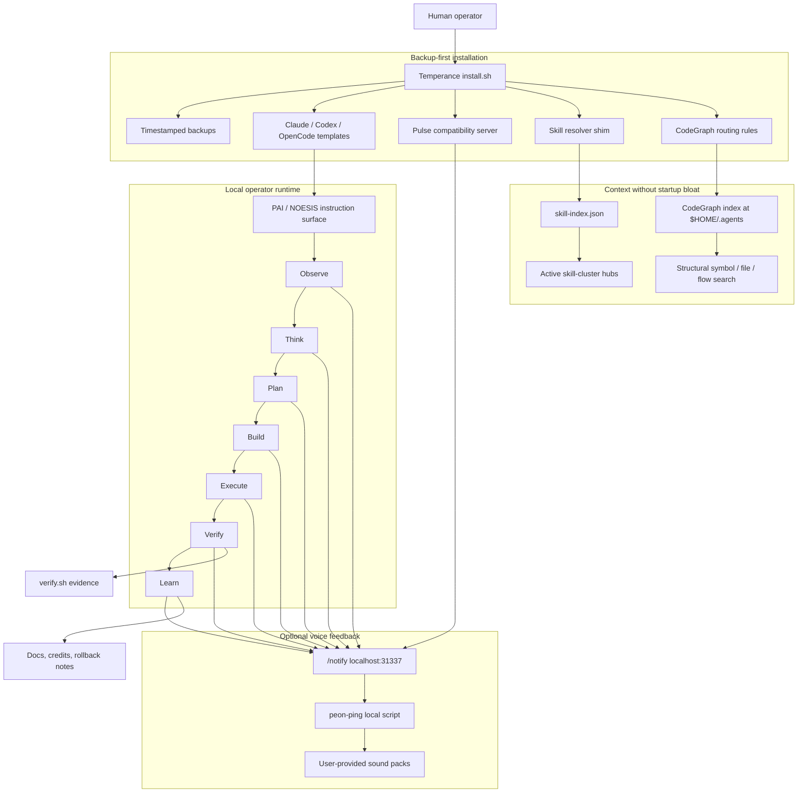

<div align="center">


# Temperance Engine

**A one-time installer for a local PAI operator runtime: Algorithm flow, skill-cluster routing, optional peon-ping voice, and CodeGraph-first search.**

Built by [Thoughtseed Labs](https://github.com/Sheshiyer).


</div>

Temperance Engine packages a local AI-operator runtime pattern: PAI-style instruction surfaces, a guarded Algorithm flow, skill-cluster routing, optional peon-ping voice feedback, and CodeGraph-first structural search.

This repository is a public installer wrapper. It does not bundle private memory, private configs, proprietary model credentials, or voice/audio packs.

---

## Why It Exists

Local AI-agent setups tend to sprawl across hidden config directories, voice hooks, MCP servers, skills, and search indexes. Temperance Engine turns a working local runtime into a reviewable public installer with backups, docs, skip-safe voice behavior, and explicit credits.

## What It Installs

- PAI instruction templates for Claude, Codex, and OpenCode.
- A local Pulse compatibility server on `localhost:31337`.
- Optional peon-ping phase routing for macOS users with local packs.
- Skill-cluster resolver guidance and install hooks.
- CodeGraph routing rules for `~/.agents`.
- Verification and rollback helpers.

## Highlights

| Capability | What it does |
|---|---|
| Guarded PAI templates | Installs `NOESIS`-style instruction surfaces without copying private memory. |
| Pulse compatibility | Provides a tiny local `/notify` and `/healthz` endpoint for phase events. |
| Optional peon-ping | Maps Algorithm phases to local sound packs without bundling audio files. |
| Skill-cluster routing | Preserves startup debloat while keeping skill discovery explicit. |
| CodeGraph-first search | Routes `.agents` structural lookup through a local AST index. |
| Backup-first installer | Copies existing target files into timestamped backups before writes. |

## Quick Start

```bash
git clone https://github.com/Sheshiyer/temperance_engine.git
cd temperance_engine
./install.sh
./verify.sh
```

On non-macOS systems, voice installation is skipped automatically. On macOS, voice integration is enabled only if a local peon-ping script is present at `~/.claude/hooks/peon-ping/peon.sh` unless `--with-voice` or `--skip-voice` is provided.

<!-- readme-gen:start:notebooklm-report -->
## 🚀 Project Intelligence Snapshot

- Developed by Thoughtseed Labs, **Temperance Engine** is a comprehensive public packaging repository and one-time installer designed to standardize and secure local AI-operator runtimes. The project addresses the problem of "configuration sprawl"—the fragmentation of local AI-agent setups across hidden directories, voice hooks, and search indexes—by consolidating these elements into a reviewable, modular framework.
- The engine integrates high-profile upstream patterns, most notably Daniel Miessler’s Personal AI Infrastructure (PAI), providing a structured environment for Algorithm-driven workflows. Its core mission is to provide a readable public repository that installs safe components, references optional local assets, and verifies configurations without leaking private machine state. Adhering to a "privacy-first" and "backup-first" philosophy, Temperance Engine ensures operators maintain absolute control over their local environment while benefiting from a unified, inspectable loop.
- [Read the full report for deeper context](.readme-notebooklm/assets/notebooklm-report.md)

<!-- readme-gen:end:notebooklm-report -->
<!-- readme-gen:start:notebooklm-mindmap -->
## 🧠 Concept Map

```mermaid
graph LR
  N001[Temperance Engine]
  N002[Core Purpose]
  N001 --> N002
  N003[Local AI-operator runtime installer]
  N002 --> N003
  N004[Unified inspectable loop]
  N002 --> N004
  N005[Eliminate configuration sprawl]
  N002 --> N005
  N006[Privacy-first and backup-first]
  N002 --> N006
  N007[Key Components]
  N001 --> N007
  N008[PAI Infrastructure]
  N007 --> N008
  N009[Algorithm-driven workflows]
  N008 --> N009
  N010[Instruction surfaces]
  N008 --> N010
  N011[ISA runtime pattern]
  N008 --> N011
  N012[Skill-Cluster Routing]
  N007 --> N012
  N013[Skill discovery via index]
  N012 --> N013
  N014[Prevents startup debloat]
  N012 --> N014
  N015[Active symlinks]
  N012 --> N015
  N016[CodeGraph Search]
  N007 --> N016
  N017[AST-backed indexing]
  N016 --> N017
  N018[Structural lookup for .agents]
  N016 --> N018
  N019[Peon-Ping Voice]
  N007 --> N019
  N020[Phase-based sound notifications]
  N019 --> N020
  N021[macOS primary support]
  N019 --> N021
  N022[Referenced (not bundled) packs]
  N019 --> N022
  N023[Pulse Compatibility Server]
  N007 --> N023
  N024[Localhost:31337 endpoint]
  N023 --> N024
  N025[Bun runtime]
  N023 --> N025
  N026[Safety & Constraints]
  N001 --> N026
  N027[Backup-first install scripts]
  N026 --> N027
  N028[POSIX-shell compatibility]
  N026 --> N028
  N029[No private memory or credentials]
  N026 --> N029
  N030[Generalized $HOME paths]
  N026 --> N030
  N031[Rollback documentation]
  N026 --> N031
  N032[Project Artifacts]
  N001 --> N032
  N033[install.sh & verify.sh]
  N032 --> N033
  N034[README (Generated & versioned)]
  N032 --> N034
  N035[Generated assets (banner/icon)]
  N032 --> N035
  N036[skills.sh skill card]
  N032 --> N036
  N037[Upstream Integrations]
  N001 --> N037
  N038[Claude Code (Anthropic)]
  N037 --> N038
  N039[OpenCode]
  N037 --> N039
  N040[OpenAI Codex CLI]
  N037 --> N040
  N041[GitHub CLI]
  N037 --> N041
  N042[ripgrep]
  N037 --> N042
```

<!-- readme-gen:end:notebooklm-mindmap -->
<!-- readme-gen:start:notebooklm-table -->
## 📊 Repository Signals Table

| Project Name | Description | Integration Type | Upstream URL | Role in Runtime | Status |
| --- | --- | --- | --- | --- | --- |
| Personal AI Infrastructure | PAI/Algorithm/ISA runtime pattern and instruction surfaces. | Principal | https://github.com/danielmiessler/Personal_AI_Infrastructure | Core runtime pattern the package installs around. | unreleased |
| OpenCode | OpenCode configuration and MCP surface. | Template installation | https://github.com/anomalyco/opencode | Receives instruction templates and MCP-related config. | verified |
| CodeGraph | Local AST-backed code indexing and structural search. | Referenced | https://github.com/colbymchenry/codegraph | Powers structural search and .agents routing rules. | unreleased |
| Claude Code | AI product surface from Anthropic. | Template installation | Not in source | Receives local instruction templates and configuration. | Not in source |
| OpenAI Codex CLI | Codex local instruction surface and auth assumptions. | Referenced | https://github.com/openai/codex | Target local instruction/config integration point. | verified |
| peon-ping | Local voice notification pattern and script surface. | Referenced | https://github.com/PeonPing/peon-ping | Maps Algorithm phases to local sound packs. | unreleased |
| ripgrep | Fast file/content search utility. | Referenced | https://github.com/BurntSushi/ripgrep | Fallback search patterns alongside structural indexing. | verified |
| Bun | High-performance JavaScript runtime. | Optional | https://github.com/oven-sh/bun | Runs local Pulse compatibility server on localhost:31337. | verified |
| GitHub CLI | Public repo/publishing workflow helper. | Optional | https://github.com/cli/cli | Used for optional repository operations. | verified |

<!-- readme-gen:end:notebooklm-table -->
<!-- readme-gen:start:notebooklm-metadata -->
## 🔍 Asset Trail

- assets-dir: .readme-notebooklm/assets
- manifest-path: .readme-notebooklm/assets/manifest.json
- source-reference: manifest.json
- source-count: 6
- source-note: README.md, CHANGELOG.md, CONTRIBUTING.md, CREDITS.md, ISA.md, SECURITY.md
- generated-at: 2026-06-13T15:29:03+0000
- notebook-id: f113fd7b-0524-4cec-915d-f712c410242c
- generation-command: python3 /Users/sheshnarayaniyer/.craft-agent/workspaces/my-workspace/skills/mvp-roadmap-orchestrator/run_mvp_pipeline.py --project-dir . --project-name 'temperance-engine' --owner 'Thoughtseed' --asset report --asset mind-map --asset data-table --output-root .readme-notebooklm
- continuity-mode: merge-queue refresh workflow
- follow-up-target: readme-continuity-refresh
- workflow-reference: .github/workflows/readme-auto-refresh.yml
- notebooklm-owner: Thoughtseed

<!-- readme-gen:end:notebooklm-metadata -->
## System Flow

Temperance Engine helps by turning a scattered local-agent setup into one explicit, inspectable loop: install safely, route work through PAI instructions, keep skills discoverable without context bloat, use CodeGraph for structural understanding, and make phase progress audible when local peon-ping packs are available.



## How It Helps

| Problem in local agent setups | Temperance Engine response |
|---|---|
| Hidden config sprawl | Installs visible templates and documents every touched surface. |
| Risky setup scripts | Uses dry-run support and backup-first writes. |
| Skill overload | Keeps skill-cluster discovery through `skill-index.json` instead of scanning everything at startup. |
| Weak codebase search | Routes `.agents` structure through CodeGraph's local index. |
| Silent long-running work | Optionally maps Algorithm phases to peon-ping voice packs. |
| Hard rollback | Documents backups and rollback commands. |

## Safe Defaults

- Backs up existing target files before writing.
- Uses `$HOME` and user-overridable environment variables.
- Does not scan `~/.agents/skill-clusters/skills` wholesale.
- Disables Augment in the OpenCode template because home and `.agents` retrieval can be blocked.
- Does not install or vendor voice packs.

## Install Flags

```bash
./install.sh --skip-voice
./install.sh --with-voice
./install.sh --dry-run
```

Useful environment variables:

```bash
PAI_HOME="$HOME/.claude"
CODEX_HOME="$HOME/.codex"
OPENCODE_HOME="$HOME/.config/opencode"
AGENTS_HOME="$HOME/.agents"
TEMPERANCE_BACKUP_DIR="$HOME/.temperance_engine/backups"
```

## Documentation

- `skills/temperance-engine/SKILL.md` is the skills.sh-ready skill card.
- `docs/architecture.md` explains the runtime model.
- `docs/pai-flow.md` explains how PAI phases work.
- `docs/skill-clusters.md` explains skill-cluster routing.
- `docs/peon-ping-packs.md` explains voice pack mapping.
- `docs/codegraph-routing.md` explains CodeGraph indexing and search rules.
- `docs/rollback.md` explains backups and recovery.
- `UPSTREAM.md` links the relevant upstream GitHub repos and docs.
- `assets/` contains generated public-facing banner and icon assets.
- `docs/skills-sh-upload.md` contains the upload checklist.

## Contributing

See `CONTRIBUTING.md` for local checks, installer safety rules, and pull-request expectations.

## Uploading To skills.sh

Use `skills/temperance-engine/SKILL.md` as the marketplace-facing skill entry. The repo-level installer remains at the root so users can review the code before running it.

Suggested listing metadata:

- Name: `Temperance Engine`
- Category: `Developer Tooling` or `Agent Operations`
- Platforms: `macOS primary`, `Linux/other with voice skipped`
- Entry file: `skills/temperance-engine/SKILL.md`
- Banner: `assets/banner.png`
- Icon: `assets/icon.png`

## Upstream Links

- [Personal AI Infrastructure](https://github.com/danielmiessler/Personal_AI_Infrastructure)
- [CodeGraph](https://github.com/colbymchenry/codegraph)
- [peon-ping](https://github.com/PeonPing/peon-ping)
- [OpenCode](https://github.com/anomalyco/opencode)
- [OpenAI Codex CLI](https://github.com/openai/codex)
- [GitHub CLI](https://github.com/cli/cli)
- [Bun](https://github.com/oven-sh/bun)
- [ripgrep](https://github.com/BurntSushi/ripgrep)

See `UPSTREAM.md` and `CREDITS.md` for the fuller attribution map.

## Status

This is a packaging repo for a local runtime pattern. Review scripts before running them on any important machine.

<div align="center">


Built for operators who want local autonomy without hidden runtime sprawl.

Built by Thoughtseed Labs.

</div>
