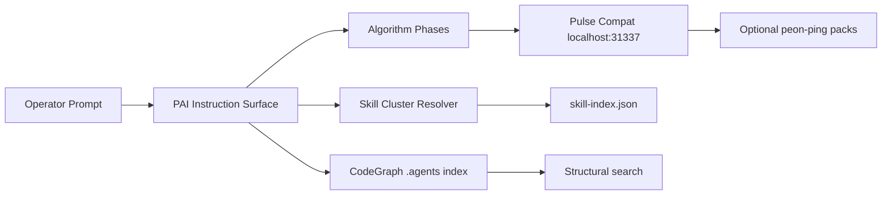

<div align="center">


# Temperance Engine

**A one-time installer for a local PAI operator runtime: Algorithm flow, skill-cluster routing, optional peon-ping voice, and CodeGraph-first search.**


</div>

Temperance Engine packages a local AI-operator runtime pattern: PAI-style instruction surfaces, a guarded Algorithm flow, skill-cluster routing, optional peon-ping voice feedback, and CodeGraph-first structural search.

This repository is a public installer wrapper. It does not bundle private memory, private configs, proprietary model credentials, or voice/audio packs.

---

## Why It Exists

Local AI-agent setups tend to sprawl across hidden config directories, voice hooks, MCP servers, skills, and search indexes. Temperance Engine turns a working local runtime into a reviewable public installer with backups, docs, skip-safe voice behavior, and explicit credits.

## What It Installs

- PAI instruction templates for Claude, Codex, and OpenCode.
- A local Pulse compatibility server on `localhost:31337`.
- Optional peon-ping phase routing for macOS users with local packs.
- Skill-cluster resolver guidance and install hooks.
- CodeGraph routing rules for `~/.agents`.
- Verification and rollback helpers.

## Highlights

| Capability | What it does |
|---|---|
| Guarded PAI templates | Installs `NOESIS`-style instruction surfaces without copying private memory. |
| Pulse compatibility | Provides a tiny local `/notify` and `/healthz` endpoint for phase events. |
| Optional peon-ping | Maps Algorithm phases to local sound packs without bundling audio files. |
| Skill-cluster routing | Preserves startup debloat while keeping skill discovery explicit. |
| CodeGraph-first search | Routes `.agents` structural lookup through a local AST index. |
| Backup-first installer | Copies existing target files into timestamped backups before writes. |

## Quick Start

```bash
git clone https://github.com/Sheshiyer/temperance_engine.git
cd temperance_engine
./install.sh
./verify.sh
```

On non-macOS systems, voice installation is skipped automatically. On macOS, voice integration is enabled only if a local peon-ping script is present at `~/.claude/hooks/peon-ping/peon.sh` unless `--with-voice` or `--skip-voice` is provided.

## Architecture



## Safe Defaults

- Backs up existing target files before writing.
- Uses `$HOME` and user-overridable environment variables.
- Does not scan `~/.agents/skill-clusters/skills` wholesale.
- Disables Augment in the OpenCode template because home and `.agents` retrieval can be blocked.
- Does not install or vendor voice packs.

## Install Flags

```bash
./install.sh --skip-voice
./install.sh --with-voice
./install.sh --dry-run
```

Useful environment variables:

```bash
PAI_HOME="$HOME/.claude"
CODEX_HOME="$HOME/.codex"
OPENCODE_HOME="$HOME/.config/opencode"
AGENTS_HOME="$HOME/.agents"
TEMPERANCE_BACKUP_DIR="$HOME/.temperance_engine/backups"
```

## Documentation

- `skills/temperance-engine/SKILL.md` is the skills.sh-ready skill card.
- `docs/architecture.md` explains the runtime model.
- `docs/pai-flow.md` explains how PAI phases work.
- `docs/skill-clusters.md` explains skill-cluster routing.
- `docs/peon-ping-packs.md` explains voice pack mapping.
- `docs/codegraph-routing.md` explains CodeGraph indexing and search rules.
- `docs/rollback.md` explains backups and recovery.
- `UPSTREAM.md` links the relevant upstream GitHub repos and docs.
- `assets/` contains generated public-facing banner and icon assets.
- `docs/skills-sh-upload.md` contains the upload checklist.

## Contributing

See `CONTRIBUTING.md` for local checks, installer safety rules, and pull-request expectations.

## Uploading To skills.sh

Use `skills/temperance-engine/SKILL.md` as the marketplace-facing skill entry. The repo-level installer remains at the root so users can review the code before running it.

Suggested listing metadata:

- Name: `Temperance Engine`
- Category: `Developer Tooling` or `Agent Operations`
- Platforms: `macOS primary`, `Linux/other with voice skipped`
- Entry file: `skills/temperance-engine/SKILL.md`
- Banner: `assets/banner.png`
- Icon: `assets/icon.png`

## Upstream Links

- [OpenCode](https://github.com/anomalyco/opencode)
- [OpenAI Codex CLI](https://github.com/openai/codex)
- [GitHub CLI](https://github.com/cli/cli)
- [Bun](https://github.com/oven-sh/bun)
- [ripgrep](https://github.com/BurntSushi/ripgrep)

See `UPSTREAM.md` and `CREDITS.md` for the fuller attribution map.

## Status

This is a packaging repo for a local runtime pattern. Review scripts before running them on any important machine.

<div align="center">


Built for operators who want local autonomy without hidden runtime sprawl.

</div>
