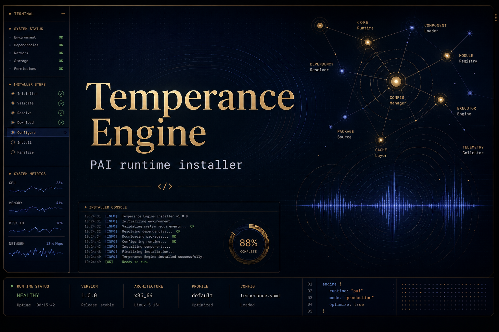
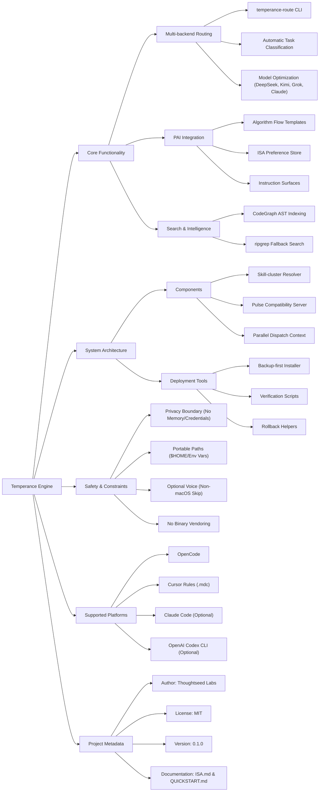
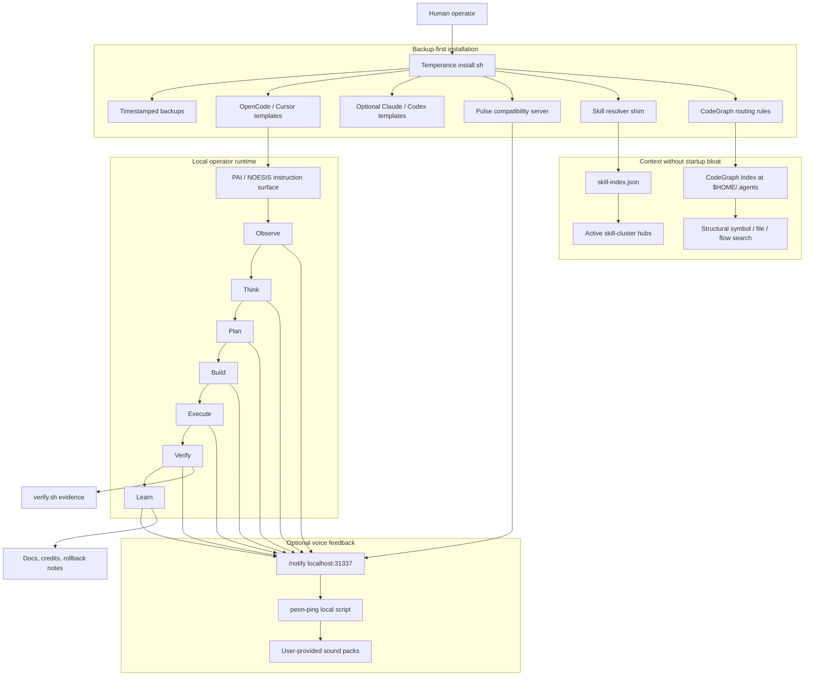
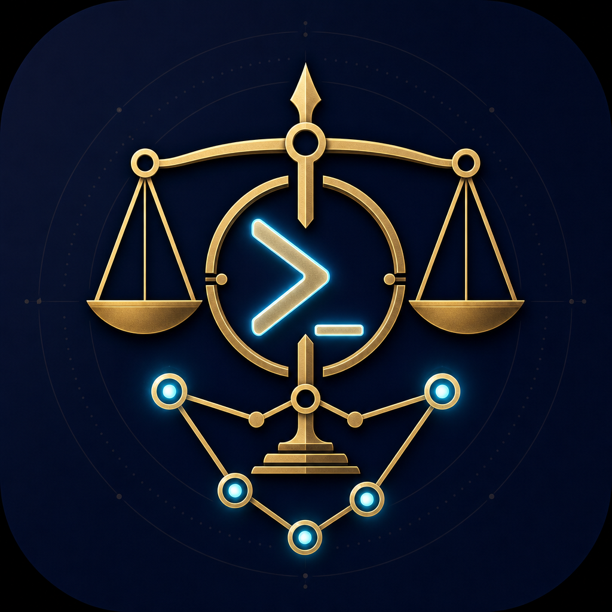

<div align="center">



# Temperance Engine

**A one-time installer for an OpenCode/Cursor-first local PAI operator runtime: Algorithm flow, skill-cluster routing, optional peon-ping voice, and CodeGraph-first search.**

Built by [Thoughtseed Labs](https://github.com/Sheshiyer).


</div>

Temperance Engine packages a local AI-operator runtime pattern for teams working primarily in OpenCode or Cursor: PAI-style instruction surfaces, a guarded Algorithm flow, skill-cluster routing, optional peon-ping voice feedback, and CodeGraph-first structural search.

This repository is a public installer wrapper. It does not require Claude Code, Claude Pro/Max, Anthropic auth, private memory, private configs, proprietary model credentials, or voice/audio packs.

---

## Why It Exists

Local AI-agent setups tend to sprawl across hidden config directories, voice hooks, MCP servers, skills, and search indexes. Temperance Engine turns a working local runtime into a reviewable public installer with backups, docs, skip-safe voice behavior, and explicit credits.

## What It Installs

- PAI instruction templates for OpenCode, Cursor, and portable `AGENTS.md` use.
- **Multi-backend routing** via `temperance-route` CLI — automatically selects optimal AI model based on task type (command-code primary with 35 models; kimi, grok, nvidia as fallbacks).
- **Enrichment context** with automatic task classification — every prompt gets a `<temperance-context>` block with routing hints.
- Optional templates for Claude Code and Codex when a user explicitly opts in.
- Optional local Pulse compatibility server on `localhost:31337` when Claude/Pulse compatibility is explicitly enabled.
- Optional peon-ping phase routing for macOS users with local packs.
- Skill-cluster resolver guidance and install hooks.
- CodeGraph routing rules for `~/.agents`.
- Verification and rollback helpers.

## Highlights

| Capability | What it does |
|---|---|
| **Multi-backend routing** | Routes tasks to optimal backend/model: command-code (35 models), kimi (262K context), grok (fast), nvidia (reasoning). |
| **Automatic task classification** | Classifies prompts as fast/long-horizon/reasoning/validation/creative and recommends optimal model. |
| Guarded PAI templates | Installs `NOESIS`-style instruction surfaces without copying private memory. |
| Pulse compatibility | Provides a tiny local `/notify` and `/healthz` endpoint for phase events. |
| Optional peon-ping | Maps Algorithm phases to local sound packs without bundling audio files. |
| Skill-cluster routing | Preserves startup debloat while keeping skill discovery explicit. |
| CodeGraph-first search | Routes `.agents` structural lookup through a local AST index. |
| Backup-first installer | Copies existing target files into timestamped backups before writes. |

## Quick Start

```bash
git clone https://github.com/Sheshiyer/temperance_engine.git
cd temperance_engine
./install.sh
./verify.sh

# Optional: Wire multi-backend routing (command-code, kimi, grok, nvidia)
./scripts/wire-multi-backend.sh
```

See [QUICKSTART.md](QUICKSTART.md) for multi-backend routing CLI usage.

Default install is OpenCode/Cursor-first. It does not install Claude Code or Codex templates unless you pass `--with-claude` or `--with-codex`.

On non-macOS systems, voice installation is skipped automatically. On macOS, voice integration is enabled only if a local peon-ping script is present at `~/.claude/hooks/peon-ping/peon.sh` unless `--with-voice` or `--skip-voice` is provided.

<!-- readme-gen:start:notebooklm-report -->
## 🚀 Project Intelligence Snapshot

- The Temperance Engine, developed by Thoughtseed Labs, is a comprehensive packaging repository and one-time installer designed for local AI-operator runtimes. It specifically targets environments utilizing **OpenCode** and **Cursor**, providing a modular framework that consolidates scattered configurations, voice hooks, MCP servers, and search indexes into a reviewable, secure system.
- The project focuses on "Absolute Source Fidelity" and safety, ensuring that the installation process does not leak private machine state, credentials, or proprietary data. By implementing a "backup-first" installation philosophy and utilizing a multi-backend routing system, the Temperance Engine allows operators to maintain local autonomy while benefiting from advanced AI orchestration patterns like the Personal AI Infrastructure (PAI) and CodeGraph structural search.
- [Read the full report for deeper context](.readme-notebooklm/assets/notebooklm-report.md)

<!-- readme-gen:end:notebooklm-report -->
<!-- readme-gen:start:notebooklm-mindmap -->
## 🧠 Concept Map



<!-- readme-gen:end:notebooklm-mindmap -->
<!-- readme-gen:start:notebooklm-table -->
## 📊 Repository Signals Table

```datatable
{"title": "Repository Signals", "src": "./.readme-notebooklm/assets/notebooklm-data-table.json"}
```

<!-- readme-gen:end:notebooklm-table -->
<!-- readme-gen:start:notebooklm-metadata -->
## 🔍 Asset Trail

- assets-dir: .readme-notebooklm/assets
- manifest-path: .readme-notebooklm/assets/manifest.json
- source-reference: manifest.json
- source-count: 6
- source-note: README.md, CHANGELOG.md, CONTRIBUTING.md, CREDITS.md, ISA.md, QUICKSTART.md
- generated-at: 2026-07-05T03:59:11+0000
- notebook-id: a6e54ace-8597-4c34-b679-88cb66af7ccc
- generation-command: READMEREBUILD_PIPELINE=/path/to/run_mvp_pipeline.py bash scripts/rebuild-readme.sh 'temperance_engine' 'Sheshiyer'
- continuity-mode: merge-queue refresh workflow
- follow-up-target: readme-continuity-refresh
- workflow-reference: .github/workflows/readme-auto-refresh.yml
- notebooklm-owner: Sheshiyer

<!-- readme-gen:end:notebooklm-metadata -->
## System Flow

Temperance Engine helps by turning a scattered local-agent setup into one explicit, inspectable loop: install safely, route work through PAI instructions, keep skills discoverable without context bloat, use CodeGraph for structural understanding, and make phase progress audible when local peon-ping packs are available.



## How It Helps

| Problem in local agent setups | Temperance Engine response |
|---|---|
| Hidden config sprawl | Installs visible templates and documents every touched surface. |
| Risky setup scripts | Uses dry-run support and backup-first writes. |
| Skill overload | Keeps skill-cluster discovery through `skill-index.json` instead of scanning everything at startup. |
| Weak codebase search | Routes `.agents` structure through CodeGraph's local index. |
| Silent long-running work | Optionally maps Algorithm phases to peon-ping voice packs. |
| Hard rollback | Documents backups and rollback commands. |

## Safe Defaults

- Backs up existing target files before writing.
- Uses `$HOME` and user-overridable environment variables.
- Does not scan `~/.agents/skill-clusters/skills` wholesale.
- Installs OpenCode and Cursor templates by default.
- Keeps Claude Code and Codex templates opt-in; no Claude subscription or Anthropic auth is required.
- Disables Augment in the OpenCode template because home and `.agents` retrieval can be blocked.
- Does not install or vendor voice packs.

## Install Flags

```bash
./install.sh --skip-voice
./install.sh --with-voice
./install.sh --dry-run
./install.sh --with-claude
./install.sh --with-codex
./install.sh --skip-opencode
./install.sh --skip-cursor
./install.sh --with-gsd
```

Useful environment variables:

```bash
PAI_HOME="$HOME/.claude"
CODEX_HOME="$HOME/.codex"
OPENCODE_HOME="$HOME/.config/opencode"
CURSOR_HOME="$HOME/.cursor"
AGENTS_HOME="$HOME/.agents"
TEMPERANCE_BACKUP_DIR="$HOME/.temperance_engine/backups"
```

## Cursor Project Setup

Cursor support is intentionally project-local. The installer places copyable templates under `$CURSOR_HOME/templates`; teams can then version them inside each project:

```bash
cp "$CURSOR_HOME/templates/temperance-engine.AGENTS.md" /path/to/project/AGENTS.md
mkdir -p /path/to/project/.cursor/rules
cp "$CURSOR_HOME/templates/temperance-engine.rules.mdc" /path/to/project/.cursor/rules/temperance-engine.mdc
```

Cursor's current rules documentation covers Project, Team, and User Rules plus `AGENTS.md`; this repo ships both a portable `AGENTS.md` template and a Cursor project-rule template.

## Documentation

- **[QUICKSTART.md](QUICKSTART.md)** — Multi-backend routing CLI quick reference.
- `docs/multi-surface-architecture.md` — Complete multi-surface orchestration architecture.
- `skills/temperance-engine/SKILL.md` is the skills.sh-ready skill card.
- `docs/architecture.md` explains the runtime model.
- `docs/architecture/architecture.html` is the visual architecture overview (business context, data flow, pipeline, layers, deployment).
- `docs/architecture/system-internals.html` documents the mechanics of every installed script and service.
- `docs/architecture/integration-map.html` shows which seams are real code paths versus reference-only documentation.
- `docs/architecture/session-trace.html` walks through one concrete install-to-session example.
- `docs/pai-flow.md` explains how PAI phases work.
- `docs/skill-clusters.md` explains skill-cluster routing.
- `docs/peon-ping-packs.md` explains voice pack mapping.
- `docs/codegraph-routing.md` explains CodeGraph indexing and search rules.
- `docs/parallel-dispatch.md` explains when to use parallel agent dispatch vs GSD execute-phase/workstreams.
- `docs/rollback.md` explains backups and recovery.
- `UPSTREAM.md` links the relevant upstream GitHub repos and docs.
- `assets/` contains generated public-facing banner and icon assets.
- `docs/skills-sh-upload.md` contains the upload checklist.

## Contributing

See `CONTRIBUTING.md` for local checks, installer safety rules, and pull-request expectations.

## Uploading To skills.sh

Use `skills/temperance-engine/SKILL.md` as the marketplace-facing skill entry. The repo-level installer remains at the root so users can review the code before running it.

Suggested listing metadata:

- Name: `Temperance Engine`
- Category: `Developer Tooling` or `Agent Operations`
- Platforms: `macOS primary`, `Linux/other with voice skipped`
- Entry file: `skills/temperance-engine/SKILL.md`
- Banner: `assets/banner.png`
- Icon: `assets/icon.png`

## Upstream Links

- [Personal AI Infrastructure](https://github.com/danielmiessler/Personal_AI_Infrastructure)
- [CodeGraph](https://github.com/colbymchenry/codegraph)
- [peon-ping](https://github.com/PeonPing/peon-ping)
- [OpenCode](https://github.com/anomalyco/opencode)
- [Cursor Rules](https://cursor.com/docs/rules)
- [OpenAI Codex CLI](https://github.com/openai/codex)
- [GitHub CLI](https://github.com/cli/cli)
- [Bun](https://github.com/oven-sh/bun)
- [ripgrep](https://github.com/BurntSushi/ripgrep)

See `UPSTREAM.md` and `CREDITS.md` for the fuller attribution map.

## Status

This is a packaging repo for a local runtime pattern. Review scripts before running them on any important machine.

<div align="center">



Built for operators who want local autonomy without hidden runtime sprawl.

Built by Thoughtseed Labs.

</div>
