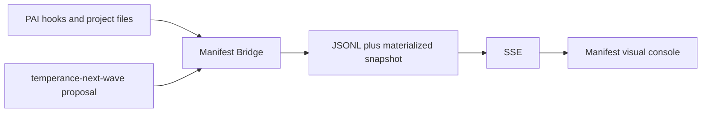
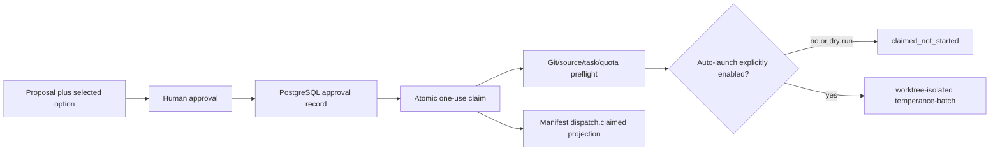

# Manifest Control Plane

Temperance Engine and Manifest Skill Cluster form one local, evidence-led operator experience. They remain separate repositories because they have different responsibilities.

| Surface | Owns | Does not own |
|---|---|---|
| Temperance / PAI | task phases, routing policy, proposal construction, approval-bound dispatch policy | visual presentation or synthetic runtime facts |
| `temperance-next-wave` | reads planning state and proposes bounded waves/options | worker authority |
| Swarm control ledger | one-use approval claims, immutable revalidation, cancellation, and outbox records | user-interface state |
| Manifest Bridge | redacted event normalization, JSONL persistence, read-model projection, and SSE | authorization or worker control |
| Manifest visual console | project-scoped operator view of bridge data | provider-health invention, approval authority, or dispatch authority |
| Operator | approves a concrete option and enables release gates deliberately | automatic approval of plans or side effects |

## Two flows, one visible system

### Observe, plan, and render



The bridge is intentionally additive. It bounds and redacts incoming data, keeps source pointers, and presents freshness honestly. A missing event, stale snapshot, or offline bridge must stay visible as such in the console.

### Algorithm activation boundary

`PromptProcessing` is the authoritative ingestion point: after it resolves
`MODE: ALGORITHM`, the shared activation helper canonicalizes `realpath` and
the Git worktree root, applies the host-owned `activation-policy.json`, then
persists `algorithm.activated`. Generic Manifest lifecycle hooks require that
per-session receipt before emitting any agent evidence. This prevents Native
work and unrelated projects from appearing as active operations.

Eligible but unenrolled repositories are **observed-only**. They receive no
repository write; an operator explicitly invokes `temperance-project-init` to
place `.temperance/manifest.json` later. The local policy is intentionally not
committed because portfolio membership belongs to the operator's machine.

### Approval-bound automatic swarm path



The ledger checks the exact project/cwd, plan, option, policy, Git head, source fingerprint, task fingerprint, paid-fleet combo, worktree requirement, concurrency, and fresh eligible quota. PostgreSQL database time consumes an approval exactly once.

## Current safety boundary

Automatic launch is **off by default**. It requires all of these deliberate conditions:

```bash
export TEMPERANCE_CONTROL_DATABASE_URL='postgresql://…'
export TEMPERANCE_SWARM_CONTROL_ENABLED=1
export TEMPERANCE_SWARM_AUTOLAUNCH=1
```

Run the controller with a frozen request first:

```bash
node "$TEMPERANCE_ROOT/package/router/temperance-swarm-dispatch.mjs" \
  --request .planning/swarm-claim.json --dry-run
```

`temperance-batch` remains a manual batch CLI. The automatic controller invokes it only after a database claim and sets `TEMPERANCE_REQUIRE_CONTROL_CLAIM=1`. Do not treat a JSONL event, an SSE message, or a console click as execution authority.

The current control slice has real PostgreSQL tests for duplicate claims, expiry, drift, quota, and cancellation. It is not yet a completed production release: worker receipt ingestion, terminal closure, lifecycle projections, and operator-facing eligibility/blocker detail are still open. See [SWARM-CONTROL-RUNBOOK.md](SWARM-CONTROL-RUNBOOK.md) and [ORCHESTRATION-GAP-REGISTER.md](ORCHESTRATION-GAP-REGISTER.md).

## Run the local operator view

Clone both repositories and keep their roots explicit:

```bash
export TEMPERANCE_ROOT=/path/to/temperance_engine
export MANIFEST_ROOT=/path/to/manifest-skill-137

cd "$TEMPERANCE_ROOT/package/manifest-bridge"
bun install
bun run src/cli.ts serve --all --port 8766

# In a second terminal:
cd "$MANIFEST_ROOT/visual-pcb"
npm install
VITE_MANIFEST_BRIDGE_URL=http://127.0.0.1:8766 npm run dev -- --host 127.0.0.1
```

Initialize and sync a project before expecting it in the console:

```bash
cd "$TEMPERANCE_ROOT"
node package/router/temperance-project-init.mjs --cwd /path/to/project
cd package/manifest-bridge
bun run src/cli.ts sync --cwd /path/to/project
```

The console reads `GET /projects`, `/health`, `/snapshot`, and `/events`. It never receives OmniRoute credentials and never renders raw prompt or tool bodies.
