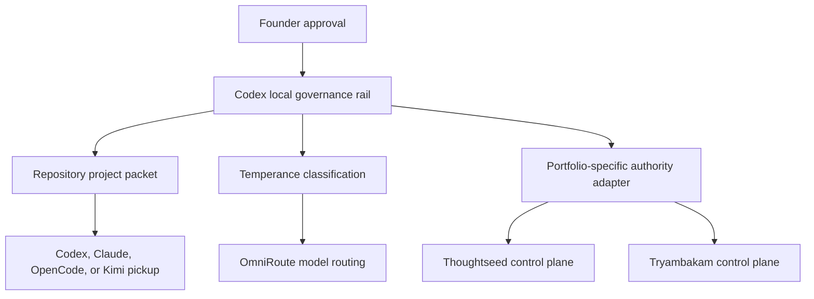

# Vault Project Relocation and Portable Pickup Design

**Status:** Portfolio taxonomy and both knowledge-registry roots ratified on 2026-08-03. Thoughtseed post-reconciliation merge-back semantics are ratified. Architecture reflects the Thoughtseed Labs control plane, revived Tryambakam plan, Kimiclaw/Tauri study, and TN × Snow Gloves clean-scope synthesis. Implementation has not started.

## Ratified Target

Keep `/Volumes/madara/2026/twc-vault/` as the PARA/Obsidian knowledge system. Keep Thoughtseed Labs at `/Volumes/madara/2026/twc-vault/01-Projects/thoughtseed/thoughtseed-labs/` as a nested knowledge vault. Relocate only approved working Git repositories into this portfolio-first code root:

```text
/Volumes/madara/2026/Projects/
├── thoughtseed/
│   └── <repository>/
└── tryambakam-noesis/
    └── <repository>/
```

The two portfolio names are an exact allowlist. Every other source or destination folder is out of scope and remains untouched. Lifecycle and repository type are metadata, never path segments.

The relocation solves the live nested-repository problem for future work. It does not erase the outer vault repository's historical objects. Historical pack analysis, compaction, or history rewriting remains a separate backup-and-approval project.

## Core Architecture Decision

Preserve **project continuity**, not native chat-session continuity.

Codex, Claude, OpenCode, or Kimi must be able to pick up a project from one bounded, client-neutral project packet at an explicit checkpoint. Native client stores remain under their existing home directories and may retain historical sessions. Relocation does not inspect, copy, rewrite, import, reconcile, or depend on those stores.

This removes Paseo and provider-session migration from inventory, preflight, apply, verification, rollback, and acceptance. The already imported Paseo workspaces and provider histories remain untouched as historical evidence; the plan neither deletes nor promises path-continuation for them. Paseo may later re-index stable paths as an optional discovery surface after code paths stabilize, but no relocation succeeds or fails because of Paseo.

OmniRoute remains a model-call router beneath agent execution. It does not own projects, tasks, handoffs, native sessions, or portfolio knowledge. The dashboard screenshot is useful operational evidence that the Codex node and `te-*` lanes are active; its call totals, ranks, latency, and model counts are a dated snapshot rather than a durable promotion contract.

## Shared Control Rail

The shared architecture is deliberately small:



- **Founder:** approves exact manifests and every mutating migration.
- **Codex:** default local interactive governor; maintains the acceptance ledger, scope, plan, checkpoints, delegation, and receipts. Codex is not a system of record.
- **Temperance:** classifies work and maps approved intent to `te-*` routing lanes.
- **OmniRoute:** selects and transports model calls, performs provider failover, and records routing evidence. It does not manage the project loop.
- **GitHub and the local checkout:** own committed repository history and uncommitted working bytes respectively.
- **Repository packet:** owns repo-scoped bootstrap and the current bounded technical checkpoint.
- **Portfolio authority:** owns durable knowledge, project identity, scheduling, external delivery, and portfolio-specific runtime state.

ChatGPT may remain the owner-facing conversational surface, but this plan does not assume that the ChatGPT web application can mount local repositories or use OmniRoute as an arbitrary backend. Repository operations and local file pickup are assigned to the Codex Desktop/CLI tool loop.

## Portfolio Isolation

The packet schema is shared; authority is not.

| Concern | Thoughtseed | Tryambakam Noesis |
|---|---|---|
| Durable knowledge | Thoughtseed Labs knowledge vault | TWC vault TN knowledge plus `_System/10865xseed` seed substrate |
| Durable project identity | TeamForge project ID; a missing mapping holds relocation | TN-owned stable project ID from the ratified TN registry; never a borrowed TeamForge ID |
| Local interactive governor | Codex by default | Codex by default, with Kimi as a supported pickup client |
| Remote/scheduled execution | Hermes/EC2 + Temperance | Kimiclaw/Kimi Work Automations |
| Model routing | verified Thoughtseed Temperance/OmniRoute deployment profile | TN Temperance/Kimiclaw adapter; OmniRoute attachment remains unverified until TN-scoped endpoint and credential boundaries pass |
| Cron registry | Thoughtseed's existing governed records | TN paperclip registry; Kimiclaw executes |
| Business-ops governance | Thoughtseed systems of record | Snow Gloves OS, with TN as proof tenant |
| Compute/product APIs | Thoughtseed-owned services | Selemene plus TN-owned Cloudflare workers |
| External command plane | Hermes Telegram surface remains unchanged | Dashboard/Kimi notifications; Thoughtseed Telegram is excluded |

Two P0 boundary rules follow:

1. “Codex holds the rails” means Codex holds the **local interactive development and approval rail**. It does not replace Hermes' Thoughtseed remote/scheduled/external operations.
2. The Tryambakam rail imports reusable Temperance code and the shared packet contract only. It does not inherit Thoughtseed's Hermes, Cambium, Telegram, TeamForge, signing, secret, Cloudflare, or Paperclip authority.

### Mutation authority during relocation

| Surface | Relocation access | Relocation result |
|---|---|---|
| Codex governance rail | writes plans, acceptance evidence, and approved transaction receipts | coordinates the exact approved mutation; gains no durable authority |
| Local Git checkout | one approved same-device rename after verification | same repository bytes at the new address |
| GitHub | read-only remote identity readback; no network command | remote ownership, permissions, protections, issues, PRs, and CODEOWNERS remain unchanged |
| Thoughtseed registry | single writer only for a `portfolio: thoughtseed` record | one digest-bound knowledge record |
| Tryambakam registry | single writer only for a `portfolio: tryambakam-noesis` record | one digest-bound knowledge record |
| Other portfolio registry | must be absent for the same stable ID or GitHub identity | any competing claim fails before mutation |
| OmniRoute and Temperance runtime | unchanged | routing continues independently of relocation |
| Native client stores and permission grants | unread and unchanged | old sessions may remain historical; fresh pickup uses the packet |
| Hermes, Kimiclaw, Paperclip, Snow Gloves, Selemene, Cloudflare, Tauri | unchanged | path consumers are reported and held, never repaired implicitly |

The relocation transaction is the only registry writer. It writes exactly one portfolio registry selected by the packet's allowlisted `portfolio` field. A stable ID or GitHub identity claimed by both registries is a hard split-brain error; there is no precedence rule and no automatic conflict repair.

Every packet carries a closed `routing.deployment_profile`, a secretless credential-scope reference, and a verification state. A Thoughtseed profile may resolve only to an approved Thoughtseed deployment. A TN profile contains no Thoughtseed Hermes, Cambium, TeamForge, Telegram, Paperclip, or credential reference and remains `unverified` until a TN-local OmniRoute attachment is proved. Packet pickup itself does not require OmniRoute; delegated routed execution fails closed while its deployment profile is unverified.

## Portable Project Packet

Each managed repository eventually contains one canonical packet:

```text
<repository>/
├── PROJECT.md
├── AGENTS.md
├── CLAUDE.md
└── .project/
    ├── CONTEXT.md
    ├── project.yaml
    └── HANDOFF.md
```

Existing rich `AGENTS.md` or `CLAUDE.md` files are preserved during inventory and relocation. A later reviewed normalization may make client-specific files thin adapters to the canonical packet; relocation never overwrites them blindly.

The packet is a **preflight prerequisite**, not a side effect of the move. It must be prepared and reviewed as its own repository change before canary approval. The relocation transaction reads and digests it but never creates or edits a file inside the checkout, preserving the approved repository-byte manifest.

### `PROJECT.md`

Human and client-neutral entry point:

- purpose and owner;
- portfolio and stable project ID;
- repository boundaries;
- knowledge record pointer;
- authority summary;
- setup, test, and verification entry points;
- pointer to `.project/HANDOFF.md`.

### `.project/project.yaml`

Strict machine contract:

```yaml
schema_version: 1
project_id: tn_example_stable_id
portfolio: tryambakam-noesis
repository: example-repository
github_repository: owner/example-repository
knowledge_ref: _System/10865xseed/projects/example-repository
governance:
  default_interactive_client: codex
  approval_profile: founder-gated
routing:
  authority: temperance-omniroute
  deployment_profile: tn-kimiclaw-omniroute
  verification_state: unverified
  credential_scope_ref: tn-local-owner-config
  plan_lane: te-plan
  review_lane: te-review
commands:
  setup: bun install
  test: bun test
  verify: bun test
context:
  - PROJECT.md
  - AGENTS.md
  - CLAUDE.md
  - .project/CONTEXT.md
  - .project/HANDOFF.md
```

The closed schema forbids secrets, credentials, provider account material, native session identifiers, prompt/response bodies, dependency state, machine-local absolute checkout paths, and portfolio-external authority claims. A Thoughtseed packet without a TeamForge-sourced ID is held; relocation cannot mint a substitute ID.

### `.project/CONTEXT.md`

Bounded architecture invariants, decision summaries, and pointers to canonical vault documents. It does not copy the company knowledge base, seed corpus, provider memory, or live task history into the repository.

### `.project/HANDOFF.md`

Bounded checkpoint, never a transcript:

- current objective;
- base commit and branch;
- clean/dirty working-tree declaration;
- completed work and decisions;
- exact next action;
- blockers;
- verification commands and results;
- evidence/receipt pointers;
- update time.

Cross-client pickup is certified only at an explicit checkpoint. A dirty checkout may still be resumed by another client in the same directory, but portable in-flight bytes are promised only by a commit, patch, or equivalent reviewed checkpoint. Raw native-chat resumption is never promised.

## Knowledge Registries

The old path remains useful, but it is not the canonical record.

Ratified registry locations:

- **Thoughtseed:** `thoughtseed-labs/20-operations/project-management/relocation-registry/thoughtseed/<repository>/`
- **Tryambakam:** `/Volumes/madara/2026/twc-vault/_System/10865xseed/projects/<repository>/`

The TN clean-pass identifies root `_System/10865xseed` as the current seed source and warns that it is dirty and still contains retired OpenClaw path assumptions. Ratifying its `projects/` registry does not authorize rewriting the seed, enabling its jobs, or moving it. Those are separate TN workstreams. No TN canary writes there while the seed has an unreviewed dirty baseline; the owner must first approve a clean or explicitly baselined exact-entry write.

`_System/10865xseed` stores reproducible invariants, plant instructions, and milestone compression. Its ratified `projects/` entries are durable identity and pointer records, not live task state, session state, or an automation database.

Each registry record stores the stable project ID, verified GitHub identity, old and current paths, knowledge relations, packet digest, relocation receipt, and rollback boundary. A Thoughtseed record's project ID must equal the verified TeamForge project ID; a missing mapping holds relocation. Tryambakam records never fabricate a TeamForge mapping.

The selected registry repository must be clean or have an owner-approved exact baseline plus a non-overlapping entry path. One exact registry entry is an explicit mutation in the approved manifest; “leave the vault untouched” means every other vault byte remains unchanged, not that the approved knowledge handoff is forbidden.

### Thoughtseed reconciliation lifecycle

The Thoughtseed relocation registry is a reconciliation ledger inside main project management, not a permanent competing project-management authority. Every entry is keyed by the verified TeamForge `project_id`; paths are attributes, never identity keys.

For each accepted repository:

1. The registry entry appends a `reconciling` transition event and owns temporary reconciliation state. Displayed status is a projection of its append-only transition log.
2. After rename, Git verification, capsule creation, and live pickup pass, current operational facts merge into the canonical main project-management record: current repository path, verified GitHub identity, packet/knowledge references, lifecycle/type metadata, a required content-addressed `relocation_evidence_ref` (`sha256:<digest>`), and a separate resolvable evidence path.
3. The cutover occurs when that main record update is read back and its digest matches the closure manifest.
4. The registry entry appends a `reconciled` transition with actor, owner-ratifier, `closed_at`, canonical project record, and closure-manifest digest; it then stops accepting operational updates except separately recorded re-verification or supersession events.
5. Historical fields—old path, transition time, owner ratification, integrity evidence, receipt, and rollback record—remain in the closed registry entry. They are not duplicated into the main project record.

“Merge back” therefore means merging the verified **outcome** into the canonical project record. It never means deleting, moving, or flattening the reconciliation directory. Closure integrity uses Git-native HEAD and canonical ref-set equality plus explicit untracked/ignored-file digests; Git packfile bytes are never treated as content identity. A reviewed Git closure commit plus the entry and manifest SHA-256 digests makes the retained evidence tamper-evident; any later correction is a new visible commit, not an in-place history rewrite.

Tryambakam does not merge into Thoughtseed project management. Its ratified `_System/10865xseed/projects/<repository>/` record remains TN-local identity and knowledge-pointer state under the previously defined dirty-baseline gate.

## Old-Path Capsule

After a verified same-volume rename, the old repository address becomes a lightweight knowledge capsule:

```text
<old-project-path>/
├── PROJECT.md
├── project-links.md
├── data/
│   └── project.yaml
└── handoffs/
    ├── relocation.md
    ├── integrity-manifest.json
    └── rollback.md
```

The capsule points to the new checkout, GitHub repository, stable project ID, portfolio registry record, project-packet digest, related knowledge, integrity evidence, and rollback boundary. It contains no `.git`, client runtime directory, provider database, native session locator, transcript, cache, dependency tree, credential, or secret.

## Source-Document Rulings

### Adopted from Thoughtseed Labs

- Thoughtseed Labs is durable company knowledge, not live chat or task state.
- TeamForge, GitHub, Huly, Clockify, Hermes, Cambium, Slack, and the vault retain their stated authority boundaries.
- Hermes remains the sole Thoughtseed remote/scheduled/Telegram execution plane.
- Any later change that names Codex as a durable Thoughtseed architecture surface requires the companion-document updates listed by Thoughtseed Labs. This design does not yet perform them.

### Adopted from the Kimiclaw/Tauri study

- Kimi Work has no prompt-submit hooks; project context is attached at dispatch time through files and adapters.
- Do not emulate missing Kimi hooks.
- Reuse Temperance routing concepts without copying a second classifier or preference store.
- Tauri is an optional cockpit and cache, never scheduler, routing authority, durable memory, or secret store.
- Tauri v1's vault-only file capability does not automatically extend to `/Volumes/madara/2026/Projects/`. It may launch an approved CLI in an external checkout; direct external-repo filesystem access needs its own capability review.
- A future Kimi/Claw controller should accept an immutable request envelope keyed by project ID and packet digest, enrich exactly once at dispatch, and return a digestible receipt. Its owner-only machine-local spool is transport state, not durable project memory; only the receipt pointer and next baton return to the handoff.

### Adopted from the TN × Snow Gloves clean pass

- It supersedes the Thoughtseed-entangled portions of the earlier Kimiclaw/Tauri topology.
- Hermes EC2, Cambium, Thoughtseed Telegram, Plexus, and the operational Thoughtseed Paperclip instance are excluded from the TN architecture.
- TN paperclip is registry-of-record for TN jobs; Kimiclaw executes approved Automations.
- Snow Gloves owns TN tenant governance and approval-gated business operations.
- Selemene and TN-owned Cloudflare surfaces remain portfolio-local.
- Locked rulings R1-R5 are planning inputs, not relocation actions.
- Product pruning, cron revival, secrets rotation, worktree removal, log pruning, Cloudflare changes, Tauri building, and Paperclip surgery remain outside this relocation tranche.

## Migration Units

Read-only inventory classifies metadata boundaries without crawling provider stores or arbitrary contents:

1. standalone Git repository;
2. linked Git worktree;
3. nested independent Git repository;
4. pinned knowledge vault;
5. non-repository or unknown entry.

Physical parent directory does not prove portfolio authority. Every repository needs an owner-approved repository-to-portfolio mapping backed by its GitHub identity and knowledge record. Known exceptions such as `snow-gloves-os` and `10869` are held rather than inferred from their current `thoughtseed/` parent; personal or mixed-lineage surfaces remain out of scope until explicitly assigned.

A duplicate basename, destination collision, missing identity, cross-device condition, unsafe symlink, or ambiguous worktree relationship fails closed. `hermes-aws-ts` is never the first canary: its systemd, runtime, sync, and companion-document path consumers require a separate dependency manifest.

Before a repository can become a canary, a second bounded read-only audit produces an **old-path consumer manifest**. It searches checked-in text plus explicitly enumerated host configuration surfaces for the exact canonical source path and approved path aliases. It classifies repository scripts/config, Git worktree administration, submodules, MCP/client project config, hooks, launchd/systemd, deployment scripts, sync jobs, documentation links, and cross-repository references. It never searches provider transcript databases, credentials, caches, or arbitrary home-directory contents. Every discovered runtime consumer is either included in a separately approved cutover plan or holds the repository.

The TN clean-pass also identifies actual Snow Gloves worktrees and a dirty seed tree. Inventory reports those facts only. It does not execute the clean-pass's proposed worktree removals, branch deletion, log pruning, secret rotation, or job enablement.

## Transaction

The default live wave contains one repository:

1. **Inventory:** classify only the two approved source portfolios and their exact destination roots.
2. **Plan:** create one deterministic manifest and capsule render plan in an owner-only receipt directory.
3. **Preflight:** verify paths, allowlist, destination absence, device identity, Git status/HEAD/refs/remotes, worktrees, submodules, LFS, untracked/ignored state, hashes, stable ID, knowledge authority, registry conflict absence, approved old-path consumer manifest, and the pre-existing packet digest.
4. **Approve:** require explicit approval of the exact source, destination, canary, and manifest digest.
5. **Rename:** perform one atomic same-volume POSIX directory rename after immediate parent-path and source device/inode revalidation. Revalidate again afterward. The stated threat model excludes a hostile privileged or same-user process racing outside the relocation lock; source-replacement and parent/path-swap attempts remain mandatory tests. No clone, fetch, pull, push, merge, checkout, garbage collection, history rewrite, provider-store operation, or Paseo operation.
6. **Verify:** prove filesystem and Git equivalence at the new path; repair only formally modeled worktree administration paths.
7. **Record:** write the portfolio-specific registry record, then the digest-bound old-path capsule. Commit or push nothing automatically.
8. **Pickup canary:** first pass the pure packet-resolver fixture, then start one fresh approved client at the new checkout using its normal auth/runtime configuration but no prior project transcript or session import. The live client must report the same stable ID and next action as the resolver.
9. **Accept:** retain a digest-bound receipt containing preflight, verification, packet, registry, capsule, pickup, and rollback evidence.

## Rollback

Rollback proceeds only when the generated capsule and post-move repository state have not drifted. It removes only transaction-created files whose path and digest match the receipt, renames the repository to the exact old path, verifies Git and filesystem state, and records the outcome.

Any capsule edit, destination drift, old-path collision, unexpected file, committed registry change, or worktree inconsistency blocks automatic rollback. Rollback never deletes unrecognized bytes to force success.

## Acceptance Gates

- only the two approved portfolio destinations are addressable;
- every byte outside the exact approved repository rename, one registry entry, one old-path capsule, and owner-only receipt remains unchanged;
- inventory and dry-run do not read or change any native client session store or Paseo state;
- every managed repository has a valid portable packet before pickup certification;
- the packet contains no secret, session ID, transcript, absolute checkout path, or cross-portfolio authority claim;
- Codex is named only as the default local interactive governor;
- OmniRoute contains only routing metadata and owns no project/session/task fields;
- portfolio registry authority is explicit and isolated;
- Git HEAD, refs, remotes, status, worktrees, and integrity hashes verify after rename;
- the old capsule points to the exact registry and packet digests;
- a pure resolver fixture can identify the objective, current state, and next action without provider input;
- a live fresh client can identify the same values without prior project transcript or session import;
- `hermes-aws-ts` and any other path-consumed runtime remain held;
- rollback rehearsal passes in a fixture before live canary approval.

## Explicitly Deferred

- Paseo re-import and all session-store migration;
- moving or merging Thoughtseed Labs;
- every portfolio other than the two approved names;
- deleting any source or destination folder;
- mass relocation and cross-volume copy;
- symlink compatibility or submodule conversion;
- Tauri, Kimiclaw, Paperclip, Snow Gloves, Selemene, Cloudflare, cron, and secrets implementation;
- provider configuration changes or copying `.codex`, `.claude`, `.opencode`, `.kimi`, `.craftagents`, or similar state;
- outer-vault Git history rewriting, pruning, garbage collection, or object-pack compaction;
- live repository relocation before reviewed inventory, canary selection, and exact-digest approval.

## Next Approval Boundary

Both portfolio registry locations are ratified. The next safe action is a read-only inventory of only `thoughtseed` and `tryambakam-noesis`. It will classify repositories and recommend one low-coupling standalone canary; it will not move, create, delete, normalize, re-import, or reconfigure anything.
