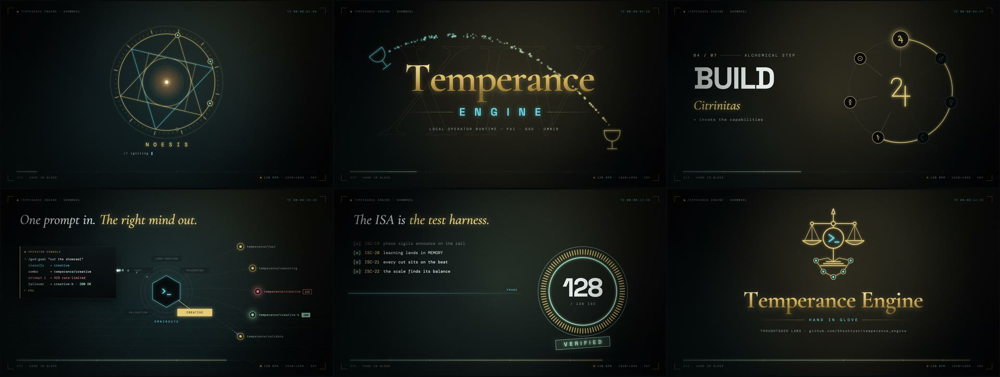

# Temperance Engine showreel

A 15-second motion showreel for Temperance Engine, in two cuts: 16:9 and 9:16.

| Cut | Size | File |
|---|---|---|
| Landscape | 1920×1080, 60 fps | [temperance-showreel.mp4](../../assets/showreel/temperance-showreel.mp4) |
| Vertical, for social media | 1080×1920, 60 fps | [temperance-showreel-9x16.mp4](../../assets/showreel/temperance-showreel-9x16.mp4) |

The files in `assets/showreel/` are web encodes. To make the full-quality masters, render them from source (see [Render](#render)).

## What the reel shows

The reel follows the seven alchemical steps that the router uses. Each cut is on a beat of a 120 BPM soundtrack. One beat is 30 frames.

| Time | Scene | Content |
|---|---|---|
| 0–2 s | Ignition | A spark draws the alchemical seal. `NOESIS` decodes. |
| 2–4 s | Title | Temperance (card XIV): a stream pours from a cyan cup into a gold cup. |
| 4–8 s | Seven phases | One phase for each beat. The planetary sigils come from `package/router/rail-announce.ts`. The background color moves from Nigredo to Rubedo. |
| 8–11 s | Routing | `/gsd:goal` goes to OmniRoute as a creative task. The first combo returns 429. The failover combo returns 200. |
| 11–13 s | Verify | Criteria move through a probe line and change to `[x]`. The gauge counts to 128. |
| 13–15 s | Lockup | The emblem draws. The impact tilts the balance beam. The beam becomes level on the last note. |

## Requirements

- [Bun](https://bun.sh)
- `ffmpeg`
- A Chromium browser: Google Chrome, Brave, or Chromium. To use a different binary, set `CHROME_BIN`.
- Network access for the first render only. The capture server keeps the Google Fonts files in `.cache/fonts/`.

There are no package dependencies. It is not necessary to run `bun install`.

## Render

Run these commands in `package/showreel/`.

| Command | Result |
|---|---|
| `bun run render` | Makes the soundtrack, then renders `out/temperance-showreel.mp4`. |
| `bun run render:vertical` | Makes the soundtrack, then renders `out/temperance-showreel-9x16.mp4`. |
| `bun run stills 60,180` | Writes the frames that you specify to `out/stills/`. |
| `bun run sound` | Writes `public/soundtrack.wav` only. |
| `bun run publish` | Makes the web encodes and `poster.jpg` in `assets/showreel/` from the two masters in `out/`. |

Options for `scripts/capture.ts`:

- `--vertical` renders the 9:16 cut.
- `--workers N` sets the number of headless browsers. The default is 5.
- `--keep-frames` keeps the PNG frames after the encode. By default, the script deletes them. Each cut has approximately 2.5 GB of frames.

A full render takes approximately 1 to 3 minutes when the font cache is full.

## Preview

1. Run `bun run sound`.
2. Open `reel.html` in a browser.
3. Click the video to play it, or push Space.

| Control | Action |
|---|---|
| Click or Space | Play or pause |
| Left arrow or right arrow | Go back or forward 1 frame |
| Shift with an arrow | Go back or forward 30 frames |
| `?aspect=9x16` | Show the vertical cut |
| `?f=N` | Open at frame N |

If `public/soundtrack.wav` is not there, the preview plays without sound.

## How it works

`reel.html` contains all of the visuals. It has one Canvas2D function, `render(frame)`, and no libraries. The same frame number always gives the same image.

`scripts/capture.ts` makes the video:

1. It starts a local server. The server sends `reel.html` and keeps a cache of the fonts.
2. It starts headless browsers. Each browser renders a different part of the 900 frames.
3. Each browser sends PNG frames to the server.
4. When the server has all 900 frames, `ffmpeg` encodes them with the soundtrack.
5. The script deletes the frames and the temporary browser profiles.

`scripts/soundtrack.ts` makes the soundtrack from code. It always makes the same file.

## Files

| Path | Content |
|---|---|
| `reel.html` | Visuals, preview player, and capture mode |
| `scripts/capture.ts` | Frame capture, font cache, and encode |
| `scripts/soundtrack.ts` | Soundtrack synthesizer |
| `scripts/publish.ts` | Web encodes and poster for `assets/showreel/` |
| `out/` | Rendered masters and stills (not in git) |
| `.cache/fonts/` | Font cache (not in git) |
| `public/soundtrack.wav` | Generated soundtrack (not in git) |
